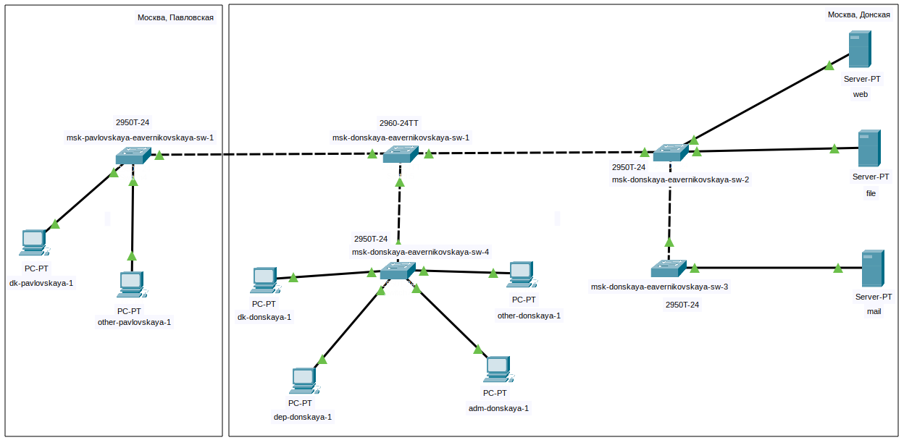
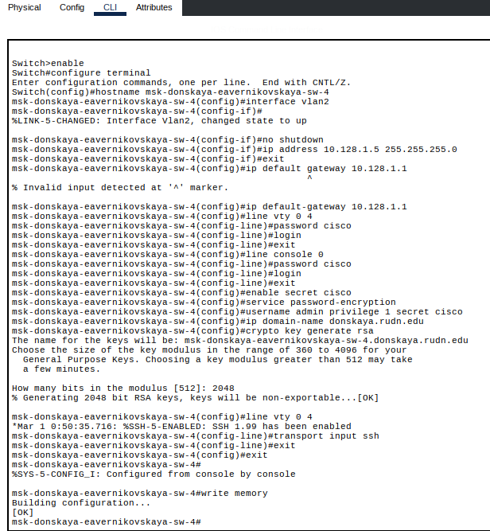

---
# Preamble

## Author
author:
  name: Верниковская Екатерина Андреевна
  degrees: DSc
  email: 11322361366@pfur.ru
  affiliation:
    - name: Российский университет дружбы народов
      country: Российская Федерация
      postal-code: 117198
      city: Москва
      address: ул. Миклухо-Маклая, д. 6

## Title
title: Отчёт по лабораторной работе №4
subtitle: Администрирование локальных сетей
license: CC BY
date: 2026-03-02

## Generic options
lang: ru-RU
crossref:
  lof-title: Список иллюстраций
  lot-title: Список таблиц
  lol-title: Листинги

## Fonts 
mainfont: PT Serif 
romanfont: PT Serif 
sansfont: PT Sans 
monofont: PT Mono 
mainfontoptions: Ligatures=TeX 
romanfontoptions: Ligatures=TeX 
sansfontoptions: Ligatures=TeX,Scale=MatchLowercase 
monofontoptions: Scale=MatchLowercase,Scale=0.9

## Formats
format:
### Pdf output format
  beamer:
    toc: true
    toc-title: Содержание
    number-sections: true
    colorlinks: false
    toc-depth: 2
    slide_level: 2
    aspectratio: 169
    section-titles: true
    theme: metropolis
    themeoptions: progressbar=frametitle,sectionpage=progressbar,numbering=fraction
    pdf-engine: xelatex
    fontenc: T2A
#### Language
    babel-lang: russian
    babel-otherlangs: english

### Html output
  revealjs:
    transition: slide
    margin: 0.2
    smaller: false
    output-ext: html
    theme: beige
    logo: _resources/image/logo_rudn.png
---

# Вводная часть

## Цель работы

Цель данной работы - провести подготовительную работу по первоначальной настройке коммутаторов сети

## Задание

Требуется сделать первоначальную настройку коммутаторов сети, представленной на схеме L1 (см. лабораторную работу №3). Под первоначальной настройкой понимается указание имени устройства, его IP-адреса, настройка доступа по паролю к виртуальным терминалам и консоли, настройка удалённого доступа к устройству по ssh. При выполнении работы необходимо учитывать соглашение об именовании

# Выполнение лабораторной работы

## Построение сети

{#fig-001 width=90%}

## Настройка коммутаторов

{#fig-002 width=40%}

## Настройка коммутаторов

{#fig-003 width=40%}

## Настройка коммутаторов

{#fig-004 width=40%}

## Настройка коммутаторов

{#fig-005 width=40%}

## Настройка коммутаторов

{#fig-006 width=50%}

# Подведение итогов

## Выводы

В ходе выполнения лабораторной работы №4 мы провели подготовительную работу по первоначальной настройке коммутаторов сети

## Список литературы

1. [Лаборатораня работа №4](https://esystem.rudn.ru/pluginfile.php/3093886/mod_resource/content/4/004-net-config.pdf)
