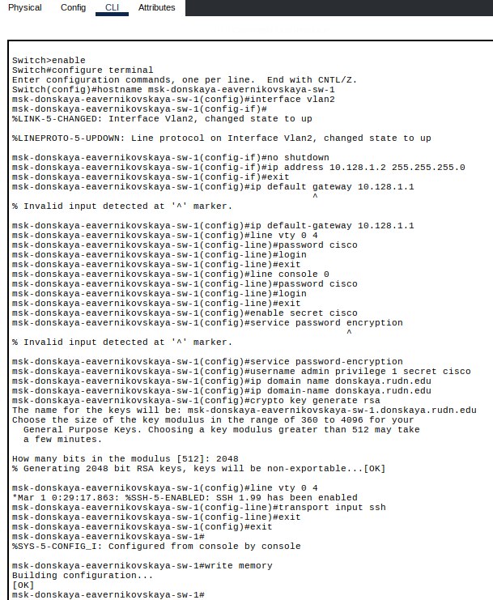
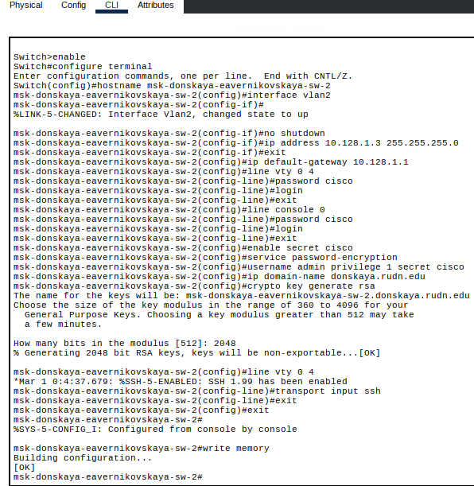
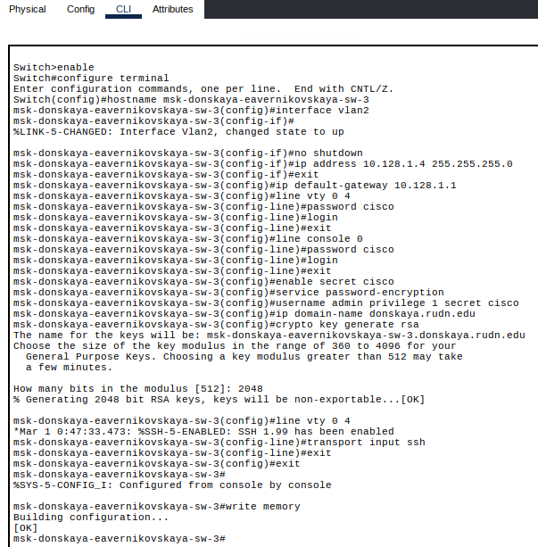
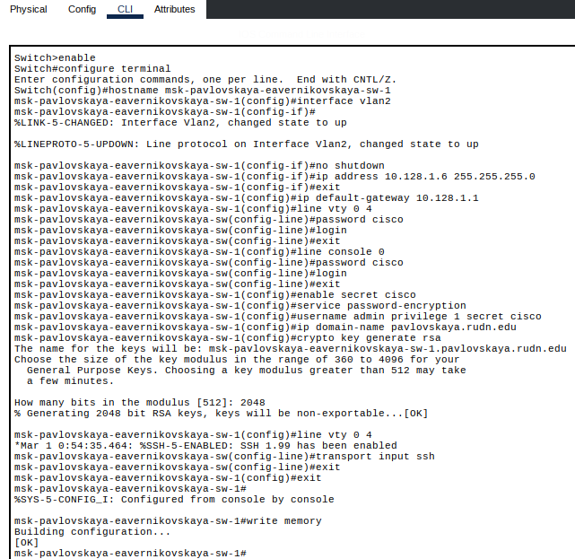

---
## Author
author:
  name: Верниковская Екатерина Андреевна
  degrees: DSc
  orcid: 0000-0002-0877-7063
  email: kulyabov-ds@rudn.ru
  affiliation:
    - name: Российский университет дружбы народов
      country: Российская Федерация
      postal-code: 117198
      city: Москва
      address: ул. Миклухо-Маклая, д. 6

## Title
title: "Отчёт по лабораторной работе №4"
subtitle: "Дисциплина: Администрирование локальных сетей"
license: "CC BY"
---

# Цель работы

Цель данной работы - провести подготовительную работу по первоначальной настройке коммутаторов сети

# Задание

Требуется сделать первоначальную настройку коммутаторов сети, представленной на схеме L1 (см. лабораторную работу №3). Под первоначальной настройкой понимается указание имени устройства, его IP-адреса, настройка доступа по паролю к виртуальным терминалам и консоли, настройка удалённого доступа к устройству по ssh. При выполнении работы необходимо учитывать соглашение об именовании

# Выполнение лабораторной работы

## Построение сети

В логической рабочей области Packet Tracer разместили коммутаторы и оконечные устройства согласно схеме сети L1 (см. лабораторную работу №3) и соединили их через соответствующие интерфейсы ([рис. @fig-001])

{#fig-001 width=70%}

## Настройка коммутаторов

Используя типовую конфигурацию коммутатора, настроили все коммутаторы, изменяя название устройства и его IP-адрес согласно плану IP (см. табл. 3.2 в лабораторной работе №3)

Провели настройку коммутатора msk-donskaya-eavernikovskaya-sw-1 ([рис. @fig-002]): 

```
Switch>enable
Switch#configure terminal
Switch(config)#hostname msk-donskaya-eavernikovskaya-sw-1
msk-donskaya-eavernikovskaya-sw-1(config)#interface vlan2
msk-donskaya-eavernikovskaya-sw-1(config-if)#no shutdown
msk-donskaya-eavernikovskaya-sw-1(config-if)#ip address 10.128.1.2 255.255.255.0
msk-donskaya-eavernikovskaya-sw-1(config-if)#exit
msk-donskaya-eavernikovskaya-sw-1(config)#ip default-gateway 10.128.1.1
msk-donskaya-eavernikovskaya-sw-1(config)#line vty 0 4
msk-donskaya-eavernikovskaya-sw-1(config-line)#password cisco
msk-donskaya-eavernikovskaya-sw-1(config-line)#login
msk-donskaya-eavernikovskaya-sw-1(config-line)#exit
msk-donskaya-eavernikovskaya-sw-1(config)#line console 0
msk-donskaya-eavernikovskaya-sw-1(config-line)#password cisco
msk-donskaya-eavernikovskaya-sw-1(config-line)#login
msk-donskaya-eavernikovskaya-sw-1(config-line)#exit
msk-donskaya-eavernikovskaya-sw-1(config)#enable secret cisco
msk-donskaya-eavernikovskaya-sw-1(config)#service password-encryption
msk-donskaya-eavernikovskaya-sw-1(config)#username admin privilege 1 secret cisco
msk-donskaya-eavernikovskaya-sw-1(config)#ip domain-name donskaya.rudn.edu
msk-donskaya-eavernikovskaya-sw-1(config)#crypto key generate rsa
msk-donskaya-eavernikovskaya-sw-1(config)#line vty 0 4
msk-donskaya-eavernikovskaya-sw-1(config-line)#transport input ssh
msk-donskaya-eavernikovskaya-sw-1(config-line)#exit
msk-donskaya-eavernikovskaya-sw-1(config)#exit
msk-donskaya-eavernikovskaya-sw-1#write memory
```

{#fig-002 width=70%}

Провели настройку коммутатора msk-donskaya-eavernikovskaya-sw-2 ([рис. @fig-003]): 

```
Switch>enable
Switch#configure terminal
Switch(config)#hostname msk-donskaya-eavernikovskaya-sw-2
msk-donskaya-eavernikovskaya-sw-2(config)#interface vlan2
msk-donskaya-eavernikovskaya-sw-2(config-if)#no shutdown
msk-donskaya-eavernikovskaya-sw-2(config-if)#ip address 10.128.1.3 255.255.255.0
msk-donskaya-eavernikovskaya-sw-2(config-if)#exit
msk-donskaya-eavernikovskaya-sw-2(config)#ip default-gateway 10.128.1.1
msk-donskaya-eavernikovskaya-sw-2(config)#line vty 0 4
msk-donskaya-eavernikovskaya-sw-2(config-line)#password cisco
msk-donskaya-eavernikovskaya-sw-2(config-line)#login
msk-donskaya-eavernikovskaya-sw-2(config-line)#exit
msk-donskaya-eavernikovskaya-sw-2(config)#line console 0
msk-donskaya-eavernikovskaya-sw-2(config-line)#password cisco
msk-donskaya-eavernikovskaya-sw-2(config-line)#login
msk-donskaya-eavernikovskaya-sw-2(config-line)#exit
msk-donskaya-eavernikovskaya-sw-2(config)#enable secret cisco
msk-donskaya-eavernikovskaya-sw-2(config)#service password-encryption
msk-donskaya-eavernikovskaya-sw-2(config)#username admin privilege 1 secret cisco
msk-donskaya-eavernikovskaya-sw-2(config)#ip domain-name donskaya.rudn.edu
msk-donskaya-eavernikovskaya-sw-2(config)#crypto key generate rsa
msk-donskaya-eavernikovskaya-sw-2(config)#line vty 0 4
msk-donskaya-eavernikovskaya-sw-2(config-line)#transport input ssh
msk-donskaya-eavernikovskaya-sw-2(config-line)#exit
msk-donskaya-eavernikovskaya-sw-2(config)#exit
msk-donskaya-eavernikovskaya-sw-2#write memory
```

{#fig-003 width=70%}

Провели настройку коммутатора msk-donskaya-eavernikovskaya-sw-3 ([рис. @fig-004]): 

```
Switch>enable
Switch#configure terminal
Switch(config)#hostname msk-donskaya-eavernikovskaya-sw-3
msk-donskaya-eavernikovskaya-sw-3(config)#interface vlan2
msk-donskaya-eavernikovskaya-sw-3(config-if)#no shutdown
msk-donskaya-eavernikovskaya-sw-3(config-if)#ip address 10.128.1.4 255.255.255.0
msk-donskaya-eavernikovskaya-sw-3(config-if)#exit
msk-donskaya-eavernikovskaya-sw-3(config)#ip default-gateway 10.128.1.1
msk-donskaya-eavernikovskaya-sw-3(config)#line vty 0 4
msk-donskaya-eavernikovskaya-sw-3(config-line)#password cisco
msk-donskaya-eavernikovskaya-sw-3(config-line)#login
msk-donskaya-eavernikovskaya-sw-3(config-line)#exit
msk-donskaya-eavernikovskaya-sw-3(config)#line console 0
msk-donskaya-eavernikovskaya-sw-3(config-line)#password cisco
msk-donskaya-eavernikovskaya-sw-3(config-line)#login
msk-donskaya-eavernikovskaya-sw-3(config-line)#exit
msk-donskaya-eavernikovskaya-sw-3(config)#enable secret cisco
msk-donskaya-eavernikovskaya-sw-3(config)#service password-encryption
msk-donskaya-eavernikovskaya-sw-3(config)#username admin privilege 1 secret cisco
msk-donskaya-eavernikovskaya-sw-3(config)#ip domain-name donskaya.rudn.edu
msk-donskaya-eavernikovskaya-sw-3(config)#crypto key generate rsa
msk-donskaya-eavernikovskaya-sw-3(config)#line vty 0 4
msk-donskaya-eavernikovskaya-sw-3(config-line)#transport input ssh
msk-donskaya-eavernikovskaya-sw-3(config-line)#exit
msk-donskaya-eavernikovskaya-sw-3(config)#exit
msk-donskaya-eavernikovskaya-sw-3#write memory
```

{#fig-004 width=70%}

Провели настройку коммутатора msk-donskaya-eavernikovskaya-sw-4 ([рис. @fig-005]): 

```
Switch>enable
Switch#configure terminal
Switch(config)#hostname msk-donskaya-eavernikovskaya-sw-4
msk-donskaya-eavernikovskaya-sw-4(config)#interface vlan2
msk-donskaya-eavernikovskaya-sw-4(config-if)#no shutdown
msk-donskaya-eavernikovskaya-sw-4(config-if)#ip address 10.128.1.5 255.255.255.0
msk-donskaya-eavernikovskaya-sw-4(config-if)#exit
msk-donskaya-eavernikovskaya-sw-4(config)#ip default-gateway 10.128.1.1
msk-donskaya-eavernikovskaya-sw-4(config)#line vty 0 4
msk-donskaya-eavernikovskaya-sw-4(config-line)#password cisco
msk-donskaya-eavernikovskaya-sw-4(config-line)#login
msk-donskaya-eavernikovskaya-sw-4(config-line)#exit
msk-donskaya-eavernikovskaya-sw-4(config)#line console 0
msk-donskaya-eavernikovskaya-sw-4(config-line)#password cisco
msk-donskaya-eavernikovskaya-sw-4(config-line)#login
msk-donskaya-eavernikovskaya-sw-4(config-line)#exit
msk-donskaya-eavernikovskaya-sw-4(config)#enable secret cisco
msk-donskaya-eavernikovskaya-sw-4(config)#service password-encryption
msk-donskaya-eavernikovskaya-sw-4(config)#username admin privilege 1 secret cisco
msk-donskaya-eavernikovskaya-sw-4(config)#ip domain-name donskaya.rudn.edu
msk-donskaya-eavernikovskaya-sw-4(config)#crypto key generate rsa
msk-donskaya-eavernikovskaya-sw-4(config)#line vty 0 4
msk-donskaya-eavernikovskaya-sw-4(config-line)#transport input ssh
msk-donskaya-eavernikovskaya-sw-4(config-line)#exit
msk-donskaya-eavernikovskaya-sw-4(config)#exit
msk-donskaya-eavernikovskaya-sw-4#write memory
```

{#fig-005 width=70%}

Провели настройку коммутатора msk-pavlovskaya-eavernikovskaya-sw-1 ([рис. @fig-006]): 

```
Switch>enable
Switch#configure terminal
Switch(config)#hostname msk-pavlovskaya-eavernikovskaya-sw-1
msk-pavlovskaya-eavernikovskaya-sw-1(config)#interface vlan2
msk-pavlovskaya-eavernikovskaya-sw-1(config-if)#no shutdown
msk-pavlovskaya-eavernikovskaya-sw-1(config-if)#ip address 10.128.1.6 255.255.255.0
msk-pavlovskaya-eavernikovskaya-sw-1(config-if)#exit
msk-pavlovskaya-eavernikovskaya-sw-1(config)#ip default-gateway 10.128.1.1
msk-pavlovskaya-eavernikovskaya-sw-1(config)#line vty 0 4
msk-pavlovskaya-eavernikovskaya-sw-1(config-line)#password cisco
msk-pavlovskaya-eavernikovskaya-sw-1(config-line)#login
msk-pavlovskaya-eavernikovskaya-sw-1(config-line)#exit
msk-pavlovskaya-eavernikovskaya-sw-1(config)#line console 0
msk-pavlovskaya-eavernikovskaya-sw-1(config-line)#password cisco
msk-pavlovskaya-eavernikovskaya-sw-1(config-line)#login
msk-pavlovskaya-eavernikovskaya-sw-1(config-line)#exit
msk-pavlovskaya-eavernikovskaya-sw-1(config)#enable secret cisco
msk-pavlovskaya-eavernikovskaya-sw-1(config)#service password-encryption
msk-pavlovskaya-eavernikovskaya-sw-1(config)#username admin privilege 1 secret cisco
msk-pavlovskaya-eavernikovskaya-sw-1(config)#ip domain-name pavlovskaya.rudn.edu
msk-pavlovskaya-eavernikovskaya-sw-1(config)#crypto key generate rsa
msk-pavlovskaya-eavernikovskaya-sw-1(config)#line vty 0 4
msk-pavlovskaya-eavernikovskaya-sw-1(config-line)#transport input ssh
msk-pavlovskaya-eavernikovskaya-sw-1(config-line)#exit
msk-pavlovskaya-eavernikovskaya-sw-1(config)#exit
msk-pavlovskaya-eavernikovskaya-sw-1#write memory
```

{#fig-006 width=70%}

## Контрольные вопросы + ответы

1. При помощи каких команд можно посмотреть конфигурацию сетевого оборудования?

show running-config

2. При помощи каких команд можно посмотреть стартовый конфигурационный файл оборудования?

show startup-config

3. При помощи каких команд можно экспортировать конфигурационный файл оборудования?

copy running-config startup-config или copy running-config flash

4. При помощи каких команд можно импортировать конфигурационный файл оборудования?

copy startup-config running-config

# Выводы

В ходе выполнения лабораторной работы №4 мы провели подготовительную работу по первоначальной настройке коммутаторов сети

# Список литературы

1. [Лаборатораня работа №4](https://esystem.rudn.ru/pluginfile.php/3093886/mod_resource/content/4/004-net-config.pdf)
