---
## Author
author:
  name: Верниковская Екатерина Андреевна
  degrees: DSc
  orcid: 0000-0002-0877-7063
  email: kulyabov-ds@rudn.ru
  affiliation:
    - name: Российский университет дружбы народов
      country: Российская Федерация
      postal-code: 117198
      city: Москва
      address: ул. Миклухо-Маклая, д. 6

## Title
title: "Отчёт по лабораторной работе №5"
subtitle: "Дисциплина: Администрирование локальных сетей"
license: "CC BY"
---

# Цель работы

Цель данной работы - получить основные навыки по настройке VLAN на коммутаторах сети

# Задание

1. На коммутаторах сети настроить Trunk-порты на соответствующих интерфейсах (см. табл. 3.2 из лабораторной работы №3), связывающих коммутаторы между собой
2. Коммутатор msk-donskaya-sw-1 настроить как VTP-сервер и прописать на нём номера и названия VLAN согласно табл. 3.1 из лабораторной работы №3
3. Коммутаторы msk-donskaya-sw-2 - msk-donskaya-sw-4, msk-pavlovskaya-sw-1 настроить как VTP-клиенты, на интерфейсах указать принадлежность к соответствующему VLAN (см. табл. 3.3 из из лабораторной работы №3)
4. На серверах прописать IP-адреса, как указано в табл. 3.2 из из лабораторной работы №3
5. На оконечных устройствах указать соответствующий адрес шлюза и прописать статические IP-адреса из диапазона соответствующей сети, следуя регламенту выделения ip-адресов (см. табл. 3.4 из из лабораторной работы №3)
6. Проверить доступность устройств, принадлежащих одному VLAN, и недоступность устройств, принадлежащих разным VLAN

# Выполнение лабораторной работы

## Настройка Trunk-портов

Используя приведённую в лабораторной работе последовательность команд из примера по конфигурации Trunk-порта на интерфейсе g0/1 коммутатора msk-donskaya-sw-1, настроили Trunk-порты на соответствующих интерфейсах всех коммутаторов

Провели настройку Trunk-порта на соответствующих интерфейсах коммутатора msk-donskaya-eavernikovskaya-sw-1 ([рис. @fig-001]): 

```
msk−donskaya-eavernikovskaya-sw−1>enable
msk−donskaya-eavernikovskaya-sw−1#configure terminal
msk−donskaya-eavernikovskaya-sw−1(config)#interface g0/1
msk−donskaya-eavernikovskaya-sw−1(config-if)#switchport mode trunk
msk−donskaya-eavernikovskaya-sw−1(config-if)#exit
msk−donskaya-eavernikovskaya-sw−1(config)#interface g0/2
msk−donskaya-eavernikovskaya-sw−1(config-if)#switchport mode trunk
msk−donskaya-eavernikovskaya-sw−1(config-if)#exit
msk−donskaya-eavernikovskaya-sw−1(config)#interface f0/1
msk−donskaya-eavernikovskaya-sw−1(config-if)#switchport mode trunk
```

{#fig-001 width=70%}

Провели настройку Trunk-порта на соответствующих интерфейсах коммутатора msk-donskaya-eavernikovskaya-sw-2 ([рис. @fig-002]): 

```
msk−donskaya-eavernikovskaya-sw−2>enable
msk−donskaya-eavernikovskaya-sw−2#configure terminal
msk−donskaya-eavernikovskaya-sw−2(config)#interface g0/1
msk−donskaya-eavernikovskaya-sw−2(config-if)#switchport mode trunk
msk−donskaya-eavernikovskaya-sw−2(config-if)#exit
msk−donskaya-eavernikovskaya-sw−2(config)#interface g0/2
msk−donskaya-eavernikovskaya-sw−2(config-if)#switchport mode trunk
```

{#fig-002 width=70%}

Провели настройку Trunk-порта на соответствующих интерфейсах коммутатора msk-donskaya-eavernikovskaya-sw-3 ([рис. @fig-003]): 

```
msk−donskaya-eavernikovskaya-sw−3>enable
msk−donskaya-eavernikovskaya-sw−3#configure terminal
msk−donskaya-eavernikovskaya-sw−3(config)#interface g0/1
msk−donskaya-eavernikovskaya-sw−3(config-if)#switchport mode trunk
```

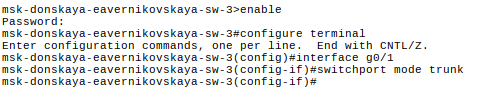{#fig-003 width=70%}

Провели настройку Trunk-порта на соответствующих интерфейсах коммутатора msk-donskaya-eavernikovskaya-sw-4 ([рис. @fig-004]): 

```
msk−donskaya-eavernikovskaya-sw−4>enable
msk−donskaya-eavernikovskaya-sw−4#configure terminal
msk−donskaya-eavernikovskaya-sw−4(config)#interface g0/1
msk−donskaya-eavernikovskaya-sw−4(config-if)#switchport mode trunk
```

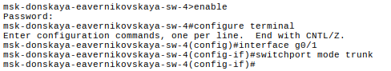{#fig-004 width=70%}

Провели настройку Trunk-порта на соответствующих интерфейсах коммутатора msk-pavlovskaya-eavernikovskaya-sw-1 ([рис. @fig-005]): 

```
msk−pavlovskaya-eavernikovskaya-sw−1>enable
msk−pavlovskaya-eavernikovskaya-sw−1#configure terminal
msk−pavlovskaya-eavernikovskaya-sw−1(config)#interface f0/24
msk−pavlovskaya-eavernikovskaya-sw−1(config-if)#switchport mode trunk
```

{#fig-005 width=70%}

## Настройка VTP-сервера

Используя приведённую в лабораторнй работе последовательность команд по конфигурации VTP, настроили коммутатор msk-donskaya-eavernikovskaya-sw-1 как VTP-сервер и прописали на нём номера и названия VLAN (см. табл. 3.1 из лабораторной работы №3) ([рис. @fig-006]):

```
msk−donskaya-eavernikovskaya-sw−1>enable
msk−donskaya-eavernikovskaya-sw−1#configure terminal
msk−donskaya-eavernikovskaya-sw−1(config)#vtp mode server
msk−donskaya-eavernikovskaya-sw−1(config)#vtp domain donskaya
msk−donskaya-eavernikovskaya-sw−1(config)#vtp password cisco
msk−donskaya-eavernikovskaya-sw−1(config)#vlan 2
msk−donskaya-eavernikovskaya-sw−1(config-vlan)#name management
msk−donskaya-eavernikovskaya-sw−1(config-vlan)#vlan 3
msk−donskaya-eavernikovskaya-sw−1(config-vlan)#name servers
msk−donskaya-eavernikovskaya-sw−1(config-vlan)#vlan 101
msk−donskaya-eavernikovskaya-sw−1(config-vlan)#name dk
msk−donskaya-eavernikovskaya-sw−1(config-vlan)#vlan 102
msk−donskaya-eavernikovskaya-sw−1(config-vlan)#name departaments
msk−donskaya-eavernikovskaya-sw−1(config-vlan)#vlan 103
msk−donskaya-eavernikovskaya-sw−1(config-vlan)#name adm
msk−donskaya-eavernikovskaya-sw−1(config-vlan)#vlan 104
msk−donskaya-eavernikovskaya-sw−1(config-vlan)#name other
```

{#fig-006 width=70%}

## Настройка VTP-клиента

Используя приведённую в лабораторнй работе последовательность команд по конфигурации диапазонов портов, настроили коммутаторы msk-donskaya-eavernikovskaya-sw-2 - msk-donskaya-eavernikovskaya-sw-4, msk-pavlovskaya-eavernikovskaya-sw-1 как VTP-клиенты и на интерфейсах указали принадлежность к VLAN (см. табл. 3.3 из лабораторной работы №3)

Настроили коммутатор msk-donskaya-eavernikovskaya-sw-2 как VTP-клиент ([рис. @fig-007]):

```
msk−donskaya-eavernikovskaya-sw−2>enable
msk−donskaya-eavernikovskaya-sw−2#conf terminal
msk−donskaya-eavernikovskaya-sw−2(config)#vtp mode client
msk−donskaya-eavernikovskaya-sw−2(config)#interface range f0/1 - 2
msk−donskaya-eavernikovskaya-sw−2(config-if-range)#switchport mode access
msk−donskaya-eavernikovskaya-sw−2(config-if-range)#switchport access vlan 3
```

{#fig-007 width=70%}

Настроили коммутатор msk-donskaya-eavernikovskaya-sw-3 как VTP-клиент ([рис. @fig-008]):

```
msk−donskaya-eavernikovskaya-sw−3>enable
msk−donskaya-eavernikovskaya-sw−3#conf terminal
msk−donskaya-eavernikovskaya-sw−3(config)#vtp mode client
msk−donskaya-eavernikovskaya-sw−3(config)#interface range f0/1 - 2
msk−donskaya-eavernikovskaya-sw−3(config-if-range)#switchport mode access
msk−donskaya-eavernikovskaya-sw−3(config-if-range)#switchport access vlan 3
```

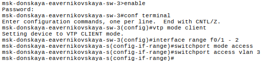{#fig-008 width=70%}

Настроили коммутатор msk-donskaya-eavernikovskaya-sw-4 как VTP-клиент ([рис. @fig-009]):

```
msk−donskaya-eavernikovskaya-sw−4>enable
msk−donskaya-eavernikovskaya-sw−4#conf terminal
msk−donskaya-eavernikovskaya-sw−4(config)#vtp mode client
msk−donskaya-eavernikovskaya-sw−4(config)#interface range f0/1 - 5
msk−donskaya-eavernikovskaya-sw−4(config-if-range)#switchport mode access
msk−donskaya-eavernikovskaya-sw−4(config-if-range)#switchport access vlan 101
msk−donskaya-eavernikovskaya-sw−4(config-if-range)#exit
msk−donskaya-eavernikovskaya-sw−4(config)#interface range f0/6 - 10
msk−donskaya-eavernikovskaya-sw−4(config-if-range)#switchport mode access
msk−donskaya-eavernikovskaya-sw−4(config-if-range)#switchport access vlan 102
msk−donskaya-eavernikovskaya-sw−4(config-if-range)#exit
msk−donskaya-eavernikovskaya-sw−4(config)#interface range f0/11 - 15
msk−donskaya-eavernikovskaya-sw−4(config-if-range)#switchport mode access
msk−donskaya-eavernikovskaya-sw−4(config-if-range)#switchport access vlan 103
msk−donskaya-eavernikovskaya-sw−4(config-if-range)#exit
msk−donskaya-eavernikovskaya-sw−4(config)#interface range f0/6 - 24
msk−donskaya-eavernikovskaya-sw−4(config-if-range)#switchport mode access
msk−donskaya-eavernikovskaya-sw−4(config-if-range)#switchport access vlan 104
msk−donskaya-eavernikovskaya-sw−4(config-if-range)#exit
```

{#fig-009 width=70%}

Настроили коммутатор msk-pavlovskaya-eavernikovskaya-sw-1 как VTP-клиент ([рис. @fig-010]):

```
msk−pavlovskaya-eavernikovskaya-sw−1>enable
msk−pavlovskaya-eavernikovskaya-sw−1#conf terminal
msk−pavlovskaya-eavernikovskaya-sw−1(config)#vtp mode client
msk−pavlovskaya-eavernikovskaya-sw−1(config)#interface range f0/1 - 15
msk−pavlovskaya-eavernikovskaya-sw−1(config-if-range)#switchport mode access
msk−pavlovskaya-eavernikovskaya-sw−1(config-if-range)#switchport access vlan 101
msk−pavlovskaya-eavernikovskaya-sw−1(config-if-range)#exit
msk−pavlovskaya-eavernikovskaya-sw−1(config)#interface range f0/20
msk−pavlovskaya-eavernikovskaya-sw−1(config-if-range)#switchport mode access
msk−pavlovskaya-eavernikovskaya-sw−1(config-if-range)#switchport access vlan 104
```

{#fig-010 width=70%}

## Настройка серверов

На серверах указали шлюз и прописали IP-адреса, как указано в табл. 3.2 из лабораторной работы №3 ([рис. @fig-011]), ([рис. @fig-012]), ([рис. @fig-013]), ([рис. @fig-014]), ([рис. @fig-015]), ([рис. @fig-016])

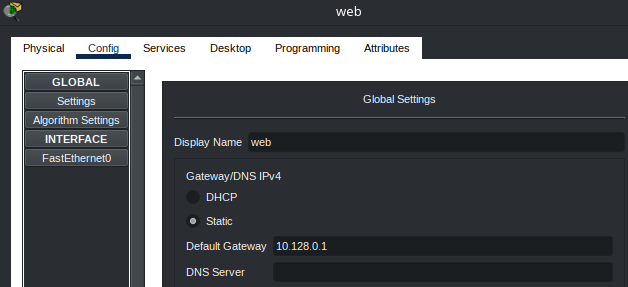{#fig-011 width=70%}

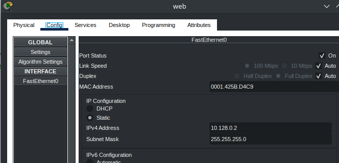{#fig-012 width=70%}

{#fig-013 width=70%}

{#fig-014 width=70%}

{#fig-015 width=70%}

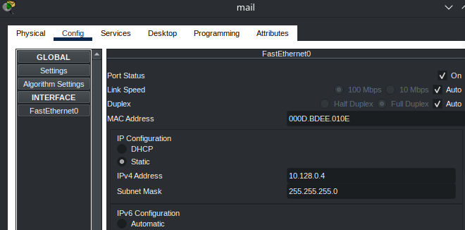{#fig-016 width=70%}

## Настройка оконечных устройств

На оконечных устройствах указали соответствующий адрес шлюза и прописали статические IP-адреса из диапазона соответствующей сети, следуя регламенту выделения ip-адресов (см. табл. 3.4 из лабораторнойработы №3) ([рис. @fig-017]), ([рис. @fig-018]), ([рис. @fig-019]), ([рис. @fig-020]), ([рис. @fig-021]), ([рис. @fig-022]), ([рис. @fig-023]), ([рис. @fig-024]), ([рис. @fig-025]), ([рис. @fig-026]), ([рис. @fig-027]), ([рис. @fig-028])

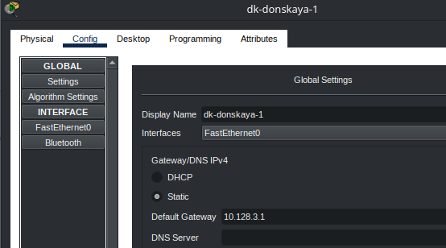{#fig-017 width=70%}

{#fig-018 width=70%}

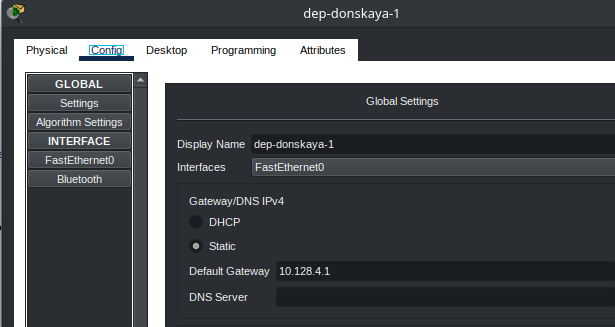{#fig-019 width=70%}

{#fig-020 width=70%}

{#fig-021 width=70%}

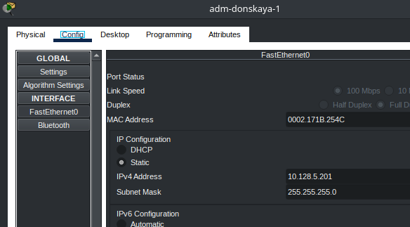{#fig-022 width=70%}

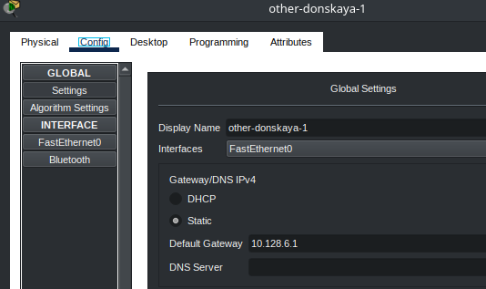{#fig-023 width=70%}

{#fig-024 width=70%}

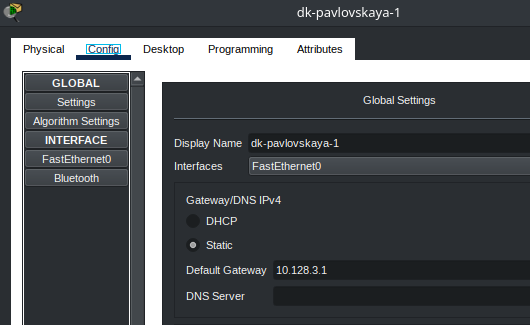{#fig-025 width=70%}

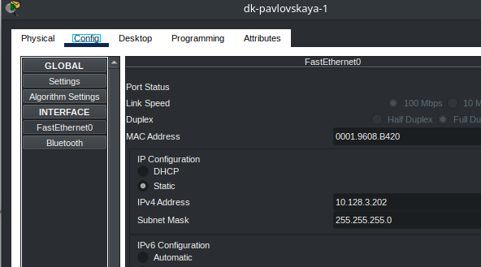{#fig-026 width=70%}

{#fig-027 width=70%}

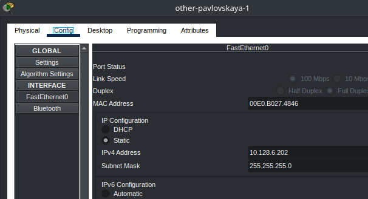{#fig-028 width=70%}

## Проверка устройств

После указания статических IP-адресов на оконечных устройствах провериои с помощью команды ping доступность устройств, принадлежащих одному VLAN, и недоступность устройств, принадлежащих разным VLAN

Внутри одного VLAN пропинговали с dk-donskaya-1 dk-pavlovskaya-1. Пакеты успешно дошли. С того же устройства попробовали пропинговать другой VLAN (например other-pavlovskaya-1). Пакеты не дошли ([рис. @fig-029])

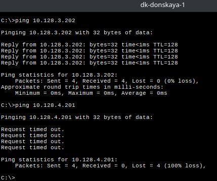{#fig-029 width=70%}

Используя режим симуляции в Packet Tracer, изучили процесс передвижения пакета ICMP по сети. Можем посмотреть информацию о пакете, его заголовки. Кадр физического уровня Ethernet, где указаны
MAC-адреса, кадр сетевого уровня IP, где указаны IP-адреса и ICMP кадр

Сначала отправили пакет с dk-donskaya-1 на dk-pavlovskaya-1. Пакет успешно дошёл ([рис. @fig-030]), ([рис. @fig-031])

{#fig-030 width=70%}

{#fig-031 width=70%}

Далее отправили пакет с dk-donskaya-1 на other-pavlovskaya-1. Пакет не дошёл. Произошёл сбой так как устройства относятся к разным VLAN ([рис. @fig-032]), ([рис. @fig-033])
 
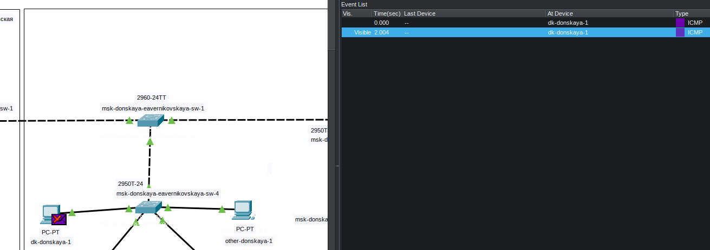{#fig-032 width=70%}

{#fig-033 width=70%}

## Контрольные вопросы + ответы

1. Какая команда используется для просмотра списка VLAN на сетевом устройстве?

show vlan

2. Охарактеризуйте VLAN Trunking Protocol (VTP). Приведите перечень команд с пояснениями для настройки и просмотра информации о VLAN.

switchport mode trunk/access:

- switchport mode trunk: устанавливает порт в режим транка (trunk), который передает данные для нескольких VLAN через один физический интерфейс
- switchport mode access: устанавливает порт в режим доступа (access), который предназначен для работы с одним определенным VLAN

switchport access vlan "номер_VLAN": назначает определенный VLAN для порта в режиме доступа

vtp mode server/client:

- vtp mode server: устанавливает коммутатор в режим сервера VTP, позволяя ему рассылать информацию о VLAN другим коммутаторам в сети
- vtp mode client: устанавливает коммутатор в режим клиента VTP, что позволяет ему принимать информацию о VLAN от серверов VTP

switchport access vlan "номер_VLAN": назначает определенный VLAN для порта в режиме доступа

vtp domain "имя_домена": устанавливает домен VTP, в котором находится коммутатор. Для синхронизации информации о VLAN, все коммутаторы в сети должны находиться в одном домене VTP с одинаковым именем

vtp password "пароль": устанавливает пароль VTP для доступа к домену VTP. Это помогает обеспечить безопасность и предотвратить несанкционированные изменения конфигурации VLAN

vlan "номер_VLAN": создает новый VLAN с указанным номером

name "имя_VLAN": присваивает имя VLAN, что делает его более понятным для администраторов сети

3. Охарактеризуйте Internet Control Message Protocol (ICMP). Опишите формат пакета ICMP.

Это протокол в семействе протоколов интернета, который используется для передачи сообщений об ошибках и других исключительных ситуациях, возникших при передаче данных в компьютерных сетях. ICMP также выполняет некоторые сервисные функции, такие как проверка доступности хостов и диагностика сетевых проблем. Формат пакета ICMP обычно состоит из заголовка и полезной нагрузки, которая может включать в себя различные поля, зависящие от типа сообщения ICMP

Основные поля заголовка ICMP включают в себя:

- Тип: определяет тип сообщения ICMP, например, сообщение об ошибках, запрос эхо и т. д.
- Код: подтип сообщения, который помогает уточнить тип сообщения. Например, для сообщения об ошибке этот код может указывать на конкретный тип ошибки
- Контрольная сумма: используется для обеспечения целостности пакета ICMP
- Дополнительные данные: в зависимости от типа и кода сообщения, может содержать дополнительные поля с информацией о сетевой проблеме или другой полезной информацией

4. Охарактеризуйте Address Resolution Protocol (ARP). Опишите формат пакета ARP.

Это протокол, используемый в компьютерных сетях для связывания IP-адресов с физическими MAC-адресами устройств в локальной сети. Он позволяет устройствам в сети определять MAC-адреса других устройств на основе их IP-адресов

Когда устройству требуется отправить пакет данных другому устройству в сети, оно сначала проверяет свою локальную таблицу ARP, чтобы узнать MAC-адрес получателя. Если необходимый MAC-адрес отсутствует в таблице ARP, устройство отправляет ARP-запрос на всю сеть, запрашивая MAC-адрес соответствующего IP-адреса. Устройство, которое имеет этот IP-адрес, отвечает на запрос, предоставляя свой MAC-адрес

Формат пакета ARP обычно состоит из следующих полей:

- Тип аппаратного адреса: определяет тип физического аппаратного адреса в сети, такой как Ethernet (значение 1)
- Тип протокола: указывает на протокол сетевого уровня, для которого запрашивается соответствие адресов, обычно IPv4 (значение 0x0800)
- Длина аппаратного адреса: указывает на размер физического адреса, обычно 6 байт для MAC-адресов Ethernet
- Длина адреса протокола: указывает на размер адреса протокола, обычно 4 байта для IPv4
- Код операции: определяет тип операции ARP, например, запрос (значение 1) или ответ (значение 2)
- MAC-адрес отправителя: физический адрес отправителя
- IP-адрес отправителя: IP-адрес отправителя. MAC-адрес получателя: физический адрес получателя (обычно пустой в ARP-запросах)
- IP-адрес получателя: IP-адрес получателя, для которого запрашивается соответствие MAC-адреса

5. Что такое MAC-адрес? Какова его структура?

Это уникальный идентификатор, присваиваемый каждому устройству или интерфейсу активного оборудования в компьютерных сетях Ethernet. Этот адрес используется для уникальной идентификации устройства в сети и обеспечения корректной передачи данных между устройствами

Структура MAC-адреса следующая:

MAC-адрес состоит из 6 байт (или 48 бит). Каждый байт разбивается на две части:

- Префикс: это первые три байта (24 бита) MAC-адреса. Префикс обычно определяет производителя устройства (Organizationally Unique Identifier, OUI). Это уникальный идентификатор, выданный Институтом инженеров электротехники и электроники (IEEE) производителям сетевого оборудования
- Идентификатор устройства: это оставшиеся три байта (24 бита) MAC-адреса. Идентификатор устройства является уникальным номером, присвоенным самим производителем идентификатора

MAC-адрес записывается в шестнадцатеричной системе счисления и обычно разделяется двоеточием или дефисом между каждыми двумя байтами (например, 01:23:45:67:89:ab). 

Использование уникальных MAC-адресов позволяет коммутирующим устройствам в сети Ethernet правильно маршрутизировать кадры данных и устанавливать точные соединения между устройствами в сети

# Выводы

В ходе выполнения лабораторной работы №5 мы получили основные навыки по настройке VLAN на коммутаторах сети

# Список литературы

1. [Лабораторная работа №5](https://esystem.rudn.ru/pluginfile.php/3093892/mod_resource/content/4/005-vlan-config.pdf)
