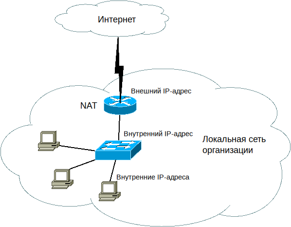
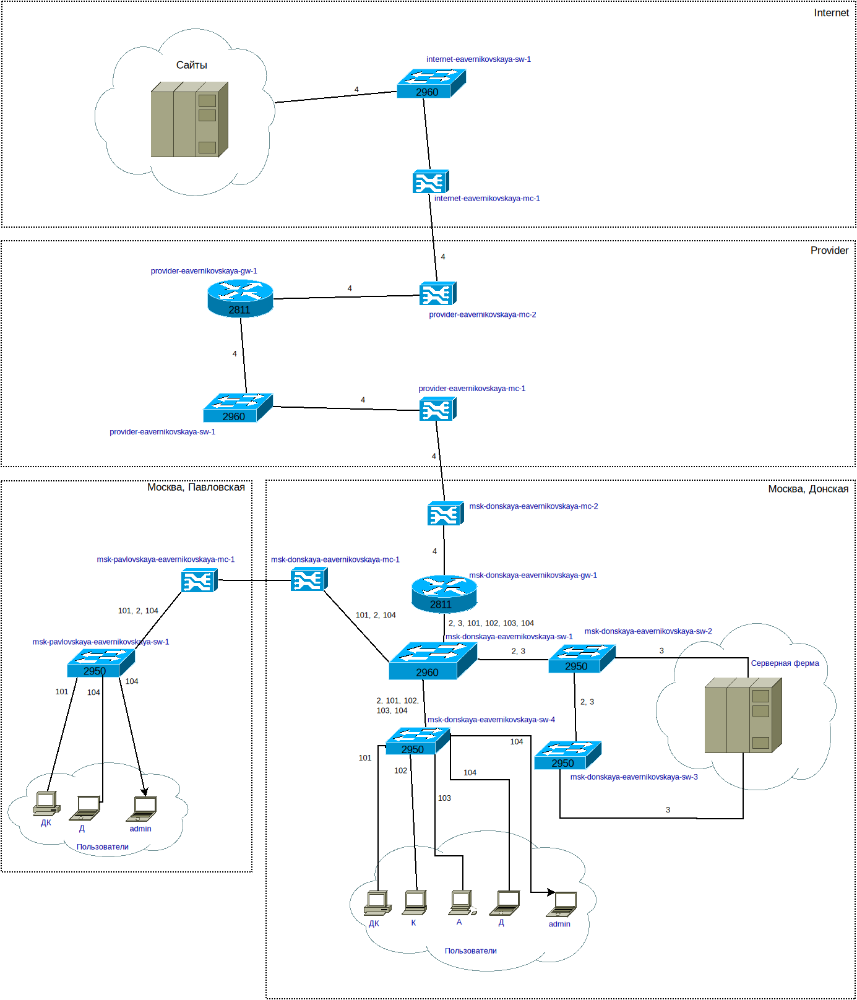
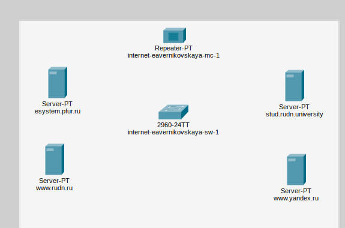
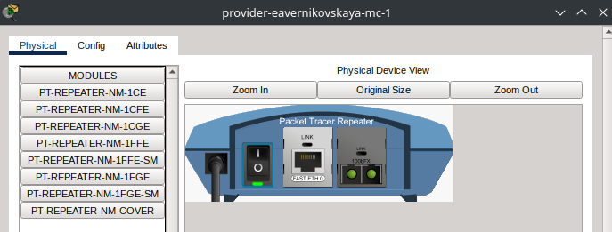
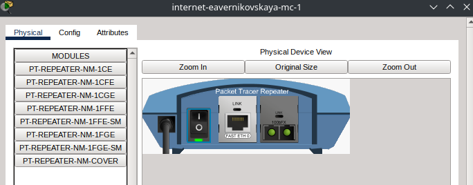
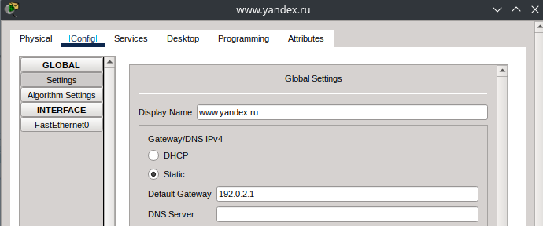
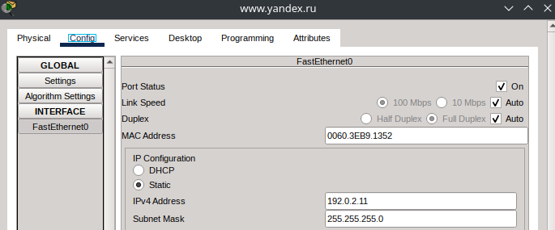
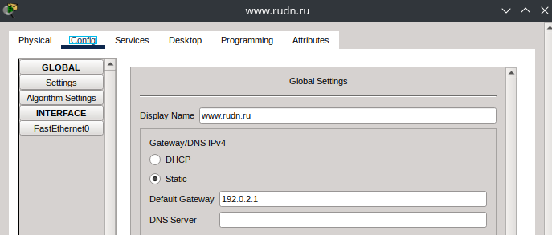
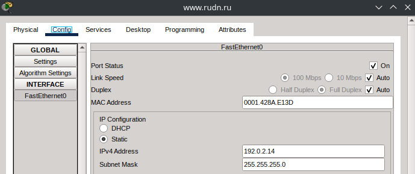

---
## Author
author:
  name: Верниковская Екатерина Андреевна
  degrees: DSc
  orcid: 0000-0002-0877-7063
  email: kulyabov-ds@rudn.ru
  affiliation:
    - name: Российский университет дружбы народов
      country: Российская Федерация
      postal-code: 117198
      city: Москва
      address: ул. Миклухо-Маклая, д. 6

## Title
title: "Отчёт по лабораторной работе №11"
subtitle: "Дисциплина: Администрирование локальных сетей"
license: "CC BY"
---

# Цель работы

Цель данной работы - провести подготовительные мероприятия по подключению локальной сети организации к Интернету

# Задание

1. Построить схему подсоединения локальной сети к Интернету
2. Построить модельные сети провайдера и сети Интернет
3. Построить схемы сетей L1, L2, L3

# Выполнение лабораторной работы

Модельные предположения:

- В сети провайдера располагаются 2 медиаконвертера provider-eavernikovskaya-mc-1 и provider-eavernikovskaya-mc-2 для связи с подсетью «Донская» и сетью модельного Интернета, маршрутизатор provider-eavernikovskaya-gw-1 и коммутатор provider-eavernikovskaya-sw-1. Оборудование соединяется между собой по Fast Ethernet
-  В модельной сети Интернет располагаются 4 сервера www.yandex.ru, www.rudn.ru, stud.rudn.university и esystem.pfur.ru, коммутатор internet-eavernikovskaya-sw-1 и медиаконвертер internet-eavernikovskaya-mc-1 для связи с сетью провайдера. Серверы подключены к коммутатору посредством Fast Ethernet, коммутатор подсоединён к медиаконвертеру также по Fast Ethernet
- Имена и адреса серверам Интернета и маршрутизатору провайдера задаются согласно (табл. \ref{table:ip}). При этом учитывается, что под сеть адресов модельного Интернета выделяется адрес 192.0.2.0/24, а под сеть провайдера - 198.51.100.1 

\begin{table}[H]
\centering
\caption{Распределение ip-адресов модельного Интернета}
\label{table:ip}
\begin{tabular}{|p{7cm}|p{7cm}|}
\hline
\textbf{IP-адреса} & \textbf{Примечание} \\ \hline
192.0.2.1 & provider-eavernikovskaya-gw-1 \\ \hline
192.0.2.11 & www.yandex.ru \\ \hline
192.0.2.12 & stud.rudn.university \\ \hline
192.0.2.13 & esystem.pfur.ru \\ \hline
192.0.2.14 & www.rudn.ru \\ \hline
\end{tabular}
\end{table}

## Работа в DIA

Network Address Translation (NAT) - механизм преобразования IP-адресов транзитных пакетов.

В частности, механизм NAT используется для обеспечения доступа устройств локальных сетей с внутренними IP-адресами к сети Интернет ([рис. @fig-001])

{#fig-001 width=70%}

Внесли изменения в схему L1 сети, добавив в неё сеть провайдера и сеть модельного Интернета с указанием названий оборудования и портов подключения ([рис. @fig-002])

{#fig-002 width=70%}

Внесли изменения в схемы L2 и L3 сети, указав адреса и VLAN сети провайдера и модельной сети Интернета ([рис. @fig-003]), ([рис. @fig-004])

{#fig-003 width=70%}

{#fig-004 width=70%}

## Корректировка таблиц

Далее скорректировали таблицы распределения IP-адресов (табл. \ref{table:ip2}) и портов (табл. \ref{table:ports})

\footnotesize
\begin{longtable}{|p{5cm}|p{7cm}|p{3cm}|}
\caption{Таблица распределения IP-адресов} \label{table:ip2} \\
\hline
\textbf{IP-адреса} & \textbf{Примечание} & \textbf{VLAN} \\ \hline
\endfirsthead
\hline
\textbf{IP-адреса} & \textbf{Примечание} & \textbf{VLAN} \\ \hline
\endhead
\hline
\multicolumn{3}{r}{\textit{Продолжение на следующей странице}} \\
\endfoot
\hline
\endlastfoot
10.128.0.0/16 & Вся сеть & \\ \hline
10.128.0.0/24 & Серверная ферма & 3 \\ \hline
10.128.0.1 & Шлюз & \\ \hline
10.128.0.2 & Web & \\ \hline
10.128.0.3 & File & \\ \hline
10.128.0.4 & Mail & \\ \hline
10.128.0.5 & Dns & \\ \hline
10.128.0.6-10.128.0.254 & Зарезервировано & \\ \hline
10.128.1.0/24 & Управление & 2 \\ \hline
10.128.1.1 & Шлюз & \\ \hline
10.128.1.2 & msk-donskaya-eavernikovskaya-sw-1 & \\ \hline
10.128.1.3 & msk-donskaya-eavernikovskaya-sw-2 & \\ \hline
10.128.1.4 & msk-donskaya-eavernikovskaya-sw-3 & \\ \hline
10.128.1.5 & msk-donskaya-eavernikovskaya-sw-4 & \\ \hline
10.128.1.6 & msk-pavlovskaya-eavernikovskaya-sw-1 & \\ \hline
10.128.1.7-10.128.1.254 & Зарезервировано & \\ \hline
10.128.2.0/24 & Cеть Point-to-Point & \\ \hline
10.128.2.1 & Шлюз & \\ \hline
10.128.2.2-10.128.2.254 & Зарезервировано & \\ \hline
10.128.3.0/24 & Дисплейные классы (ДК) & 101 \\ \hline
10.128.3.1 & Шлюз & \\ \hline
10.128.3.2-10.128.3.254 & Пул для пользователей & \\ \hline
10.128.4.0/24 & Кафедры (К) & 102 \\ \hline
10.128.4.1 & Шлюз & \\ \hline
10.128.4.2-10.128.4.254 & Пул для пользователей & \\ \hline
10.128.5.0/24 & Администрация (А) & 103 \\ \hline
10.128.5.1 & Шлюз & \\ \hline
10.128.5.2-10.128.5.254 & Пул для пользователей & \\ \hline
10.128.6.0/24 & Другие пользователи (Д) & 104 \\ \hline
10.128.6.1 & Шлюз & \\ \hline
10.128.6.2-10.128.6.254 & Пул для пользователей & \\ \hline
192.0.2.1 & provider-eavernikovskaya-gw-1 & \\ \hline
192.0.2.11 & www.yandex.ru & 4 \\ \hline
192.0.2.12 & stud.rudn.university & 4 \\ \hline
192.0.2.13 & esystem.pfur.ru & 4 \\ \hline
192.0.2.14 & www.rudn.ru & 4 \\ \hline
\end{longtable}

\footnotesize
\begin{longtable}{|p{5cm}|p{1.5cm}|p{5cm}|p{1.5cm}|p{1.5cm}|}
\caption{Таблица портов} \label{table:ports} \\
\hline
\textbf{Устройство} & \textbf{Порт} & \textbf{Примечание} & \textbf{Access VLAN} & \textbf{Trunk VLAN} \\ \hline
\endfirsthead
\hline
\textbf{Устройство} & \textbf{Порт} & \textbf{Примечание} & \textbf{Access VLAN} & \textbf{Trunk VLAN} \\ \hline
\endhead
\hline
\multicolumn{5}{r}{\textit{Продолжение на следующей странице}} \\
\endfoot
\hline
\endlastfoot
msk-donskaya-eavernikovskaya-gw-1 & f0/0 & msk-donskaya-eavernikovskaya-sw-1 &  & 2, 3, 101, 102, 103, 104 \\ \hline
 & f0/1 & msk-donskaya-eavernikovskaya-mc-2 &  &  \\ \hline
msk-donskaya-eavernikovskaya-sw-1 & f0/24 & msk-donskaya-eavernikovskaya-gw-1 &  & 2, 3, 101, 102, 103, 104 \\ \hline
 & g0/1 & msk-donskaya-eavernikovskaya-sw-2 &  &  \\ \hline
 & g0/2 & msk-donskaya-eavernikovskaya-sw-3 &  & 2, 101, 102, 103, 104 \\ \hline
 & f0/20-f0/23 & msk-donskaya-eavernikovskaya-sw-4 &  & 2, 3 \\ \hline
 & f0/1 & msk-donskaya-eavernikovskaya-mc-1 &  & 2, 101, 104 \\ \hline
msk-donskaya-eavernikovskaya-sw-2 & g0/1 & msk-donskaya-eavernikovskaya-sw-1 &  & 2, 3 \\ \hline
 & g0/2 & msk-donskaya-eavernikovskaya-sw-3 &  & 2, 3 \\ \hline
 & f0/1 & Web-server & 3 &  \\ \hline
 & f0/2 & File-server & 3 &  \\ \hline
msk-donskaya-eavernikovskaya-sw-3 & g0/1 & msk-donskaya-eavernikovskaya-sw-2 &  & 2, 3 \\ \hline
 & g0/2 & msk-donskaya-eavernikovskaya-sw-1 &  &  \\ \hline
 & f0/1 & Mail-server & 3 &  \\ \hline
 & f0/2 & Dns-server & 3 &  \\ \hline
msk-donskaya-eavernikovskaya-sw-4 & f0/20-f0/23 & msk-donskaya-eavernikovskaya-sw-1 &  & 2, 101, 102, 103, 104 \\ \hline
 & f0/1-f0/5 & dk & 101 &  \\ \hline
 & f0/6-f0/10 & departments & 102 &  \\ \hline
 & f0/11-f0/15 & adm & 103 &  \\ \hline
 & f0/24 & admin & 104 &  \\ \hline
 & f0/16-f0/24 & other & 104 &  \\ \hline
msk-donskaya-eavernikovskaya-mc-1 & f0/0 & msk-donskaya-eavernikovskaya-sw-1 &  &  \\ \hline
 & f0/1 & msk-pavlovksya-eavernikovskaya-mc-1 &  &  \\ \hline
msk-donskaya-eavernikovskaya-mc-2 & f0/0 & msk-donskaya-eavernikovskaya-gw-1 &  &  \\ \hline
 & f0/1 & provider-eavernikovskaya-mc-1 &  &  \\ \hline
msk-pavlovskaya-eavernikovskaya-sw-1 & f0/24 & msk-pavlovskaya-eavernikovskaya-mc-1 &  & 2, 101, 104 \\ \hline
 & f0/23 & admin-pavlovskaya & 104 &  \\ \hline
 & f0/1-f0/15 & dk & 101 &  \\ \hline
 & f0/20 & other & 104 &  \\ \hline
msk-pavlovskaya-eavernikovskaya-mc-1 & f0/0 & msk-pavlovskaya-eavernikovskaya-sw-1 &  &  \\ \hline
 & f0/1 & msk-donskaya-eavernikovskaya-mc-1 &  &  \\ \hline
provider-eavernikovskaya-mc-1 & f0/0 & provider-eavernikovskaya-sw-1 &  &  \\ \hline
 & f0/1 & msk-donskaya-eavernikovskaya-mc-2 &  &  \\ \hline
provider-eavernikovskaya-mc-2 & f0/0 & provider-eavernikovskaya-gw-1 &  &  \\ \hline
 & f0/1 & internet-eavernikovskaya-mc-1 &  &  \\ \hline
provider-eavernikovskaya-sw-1 & f0/2 & provider-eavernikovskaya-gw-1 &  &  \\ \hline
 & f0/1 & provider-eavernikovskaya-mc-1 &  &  \\ \hline
provider-eavernikovskaya-gw-1 & f0/0 & provider-eavernikovskaya-sw-1 &  &  \\ \hline
 & f0/1 & provider-eavernikovskaya-mc-2 &  &  \\ \hline
internet-eavernikovskaya-mc-1 & f0/0 & internet-eavernikovskaya-sw-1 &  &  \\ \hline
 & f0/1 & provider-eavernikovskaya-mc-2 &  &  \\ \hline
internet-eavernikovskaya-sw-1 & f0/1 & internet-eavernikovskaya-mc-1 &  &  \\ \hline
 & f0/2 & esystem.pfur.ru &  &  \\ \hline
 & f0/3 & www.rudn.ru &  &  \\ \hline
 & f0/4 & stud.rudn.university &  &  \\ \hline
 & f0/5 & www.yandex.ru &  &  \\ \hline
\end{longtable}

## Работа в Cisco Packet Tracer

На схеме предыдущего проекта разместили необходимое оборудование для сети провайдера и сети модельного Интернета: 4 медиаконвертера (Repeater-PT), 2 коммутатора типа Cisco 2960-24TT, маршрутизатор типа Cisco 2811, 4 сервера. Присвоили им названия ([рис. @fig-005])

{#fig-005 width=70%}

В физической рабочей области добавили здание провайдера и здание, имитирующее расположение серверов модельного Интернета. Присвоили им соответствующие названия ([рис. @fig-006])

{#fig-006 width=70%}

Перенесли из сети «Донская» оборудование провайдера ([рис. @fig-007]) и модельной сети Интернета ([рис. @fig-008]) в соответствующие здания

{#fig-007 width=70%}

{#fig-008 width=70%}

На медиаконвертерах заменили имеющиеся модули на PT-REPEATERNM-1FFE и PT-REPEATER-NM-1CFE для подключения витой пары по технологии Fast Ethernet и оптоволокна соответственно ([рис. @fig-009]), ([рис. @fig-010]), ([рис. @fig-011]), ([рис. @fig-012])

{#fig-009 width=70%}

{#fig-010 width=70%}

{#fig-011 width=70%}

{#fig-012 width=70%}

Далее првели соединение объектов согласно скорректированной нами схеме L1 ([рис. @fig-013]), ([рис. @fig-014])

{#fig-013 width=70%}

{#fig-014 width=70%}

Далее прописали IP-адреса серверам согласно (табл. \ref{table:ip}) ([рис. @fig-015]), ([рис. @fig-016]), ([рис. @fig-017]), ([рис. @fig-018]), ([рис. @fig-019]), ([рис. @fig-020]), ([рис. @fig-021]), ([рис. @fig-022])

{#fig-015 width=70%}

{#fig-016 width=70%}

{#fig-017 width=70%}

{#fig-018 width=70%}

{#fig-019 width=70%}

{#fig-020 width=70%}

{#fig-021 width=70%}

{#fig-022 width=70%}

Далее прописали сведения о серверах на DNS-сервере сети «Донская»

{#fig-023 width=70%}

## Контрольные вопросы + ответы

1. Что такое Network Address Translation (NAT)?

Network Address Translation (NAT) - механизм преобразования IP-адресов транзитных пакетов

2. Как определить, находится ли узел сети за NAT?

- Просмотр сетевой конфигурации: если узел имеет локальный IP-адрес из диапазона 192.168.x.x, 10.x.x.x или 172.16.x.x, вероятно, он находится за NAT
- Проверка маршрутизации: при использовании traceroute (tracert в Windows) можно увидеть IP-адреса маршрута. Если он проходит через общедоступные IP-адреса, узел, скорее всего, за NAT
- Проверка портов: если администратор сети настроил порты NAT для перенаправления трафика на устройства внутри локальной сети, подключение к определенному порту на общедоступном IP-адресе может указывать на использование NAT
- Использование онлайн-инструментов: некоторые онлайн-сервисы могут анализировать IP-адрес узла и определить, используется ли NAT.

3. Какое оборудование отвечает за преобразование адреса методом NAT?

Оборудование, отвечающее за преобразование адресов методом NAT, включает в себя маршрутизаторы (роутеры), межсетевые экраны (firewalls) и прокси-серверы

4. В чём отличие статического, динамического и перегруженного NAT?

Статический NAT (SNAT): каждый локальный IP-адрес отображается на соответствующий общедоступный IP-адрес
- Динамический NAT (DNAT): локальные IP-адреса отображаются на общедоступные IP-адреса из пула, с временным выделением адресов
- NAT с перегрузкой (Overloaded NAT или PAT): в этом случае, помимо изменения IP-адресов, также происходит изменение портов, позволяя множеству устройств использовать один общедоступный IP-адрес

5. Охарактеризуйте типы NAT.

- Cтатический NAT (Static NAT, SNAT) - осуществляет преобразование адресов по принципу 1:1 (в частности, один локальный IP-адрес преобразуется во внешний адрес, выделенный, например, провайдером)
- Динамический NAT (Dynamic NAT, DNAT) - осуществляет преобразование адресов по принципу 1:N (например, один адрес устройства локальной сети преобразуется в один из адресов диапазона внешних адресов)
- NAT Overload (или NAT Masquerading, или Port Address Translation, PAT) - осуществляет преобразование адресов по принципу N:1 (например, адреса группы устройств локальной подсети преобразуются в один внешний адрес, при этом дополнительно используется механизм адресации через номера портов)

# Выводы

В ходе выполнения лабораторной работы №11 мы провели подготовительные мероприятия по подключению локальной сети организации к Интернету

# Список литературы

1. [Лаборатораня работа №11](https://esystem.rudn.ru/pluginfile.php/3093917/mod_resource/content/10/011-nat-planning.pdf)
