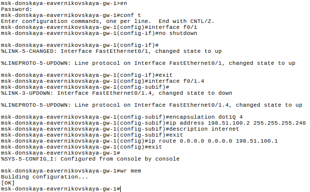
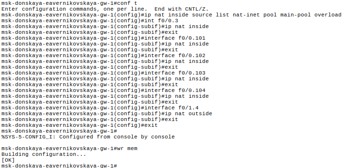
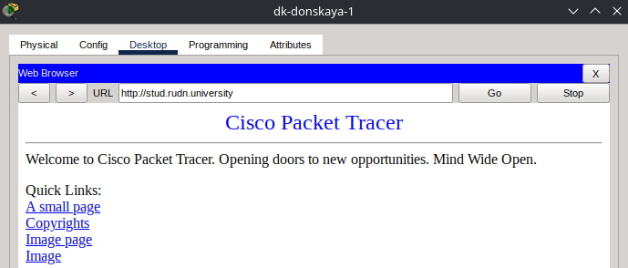
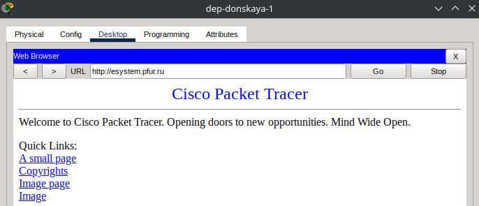
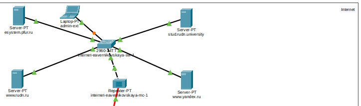
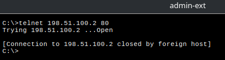
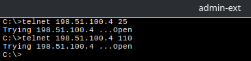
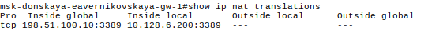

---
## Author
author:
  name: Верниковская Екатерина Андреевна
  degrees: DSc
  orcid: 0000-0002-0877-7063
  email: kulyabov-ds@rudn.ru
  affiliation:
    - name: Российский университет дружбы народов
      country: Российская Федерация
      postal-code: 117198
      city: Москва
      address: ул. Миклухо-Маклая, д. 6

## Title
title: "Отчёт по лабораторной работе №12"
subtitle: "Дисциплина: Администрирование локальных сетей"
license: "CC BY"
---

# Цель работы

Цель данной работы - приобрести практические навыки по настройке доступа локальной сети к внешней сети посредством NAT

# Задание

1. Сделать первоначальную настройку маршрутизатора provider-eavernikovskaya-gw-1 и коммутатора provider-eavernikovskaya-sw-1 провайдера: задать имя, настроить доступ по паролю и т.п.
2. Настроить интерфейсы маршрутизатора provider-eavernikovskaya-gw-1 и коммутатора provider-eavernikovskaya-sw-1 провайдера
3. Настроить интерфейсы маршрутизатора сети «Донская» для доступа к сети провайдера
4. Настроить на маршрутизаторе сети «Донская» NAT с правилами, указанными в лабораторной работе
5. Настроить доступ из внешней сети в локальную сеть организации, как указано в лабораторной работе
6. Проверить работоспособность заданных настроек

# Выполнение лабораторной работы

## Первоначальная настройка маршрутизатора provider-eavernikovskaya-gw-1

Настроили маршрутизатор provider-eavernikovskaya-gw-1. Задали имя и настроили доступ по паролю ([рис. @fig-001]):

```
msk−provider-eavernikovskaya-gw-1>en
msk−provider-eavernikovskaya-gw-1#configure terminal
msk−provider-eavernikovskaya-gw-1(config)#line vty 0 4
msk−provider-eavernikovskaya-gw-1(config-line)#password 
msk−provider-eavernikovskaya-gw-1(config-line)#login
msk−provider-eavernikovskaya-gw-1(config-line)#exit
msk−provider-eavernikovskaya-gw-1(config)#line console 0
msk−provider-eavernikovskaya-gw-1(config-line)#password cisco
msk−provider-eavernikovskaya-gw-1(config-line)#login
msk−provider-eavernikovskaya-gw-1(config-line)#exit
msk−provider-eavernikovskaya-gw-1(config)#enable secret cisco
msk−provider-eavernikovskaya-gw-1(config)#service password-encryption
msk−provider-eavernikovskaya-gw-1(config)#username admin privilege 1 secret cisco
```

{#fig-001 width=70%}

## Первоначальная настройка коммутатора provider-eavernikovskaya-sw-1

Настроили коммутатор provider-eavernikovskaya-sw-1. Задали имя и настроили доступ по паролю ([рис. @fig-002]):

```
msk−provider-eavernikovskaya-sw-1>en
msk−provider-eavernikovskaya-sw-1#configure terminal
msk−provider-eavernikovskaya-sw-1(config)#line vty 0 4
msk−provider-eavernikovskaya-sw-1(config-line)#password 
msk−provider-eavernikovskaya-sw-1(config-line)#login
msk−provider-eavernikovskaya-sw-1(config-line)#exit
msk−provider-eavernikovskaya-sw-1(config)#line console 0
msk−provider-eavernikovskaya-sw-1(config-line)#password cisco
msk−provider-eavernikovskaya-sw-1(config-line)#login
msk−provider-eavernikovskaya-sw-1(config-line)#exit
msk−provider-eavernikovskaya-sw-1(config)#enable secret cisco
msk−provider-eavernikovskaya-sw-1(config)#service password-encryption
msk−provider-eavernikovskaya-sw-1(config)#username admin privilege 1 secret cisco
```

{#fig-002 width=70%}

## Настройка интерфейсов маршрутизатора provider-eavernikovskaya-gw-1

Настроили интерфейсы маршрутизатора provider-eavernikovskaya-gw-1. Подняли интерфейсы f0/0 и f0/1, создали интерфейс f0/0.4 для vlan 4 и задали ip-адрес ([рис. @fig-003]):

```
msk−provider-eavernikovskaya-gw-1>en
msk−provider-eavernikovskaya-gw-1#configure terminal
msk−provider-eavernikovskaya-gw-1(config)#interface f0/0
msk−provider-eavernikovskaya-gw-1(config-if)#no shutdown 
msk−provider-eavernikovskaya-gw-1(config-if)#exit
msk−provider-eavernikovskaya-gw-1(config)#interface f0/0.4
msk−provider-eavernikovskaya-gw-1(config-subif)#encapsulation dot1Q 4
msk−provider-eavernikovskaya-gw-1(config-subif)#ip address 198.51.100.1 255.255.255.240
msk−provider-eavernikovskaya-gw-1(config-subif)#description msk-donskaya
msk−provider-eavernikovskaya-gw-1(config-subif)#exit
msk−provider-eavernikovskaya-gw-1(config)#interface f0/1
msk−provider-eavernikovskaya-gw-1(config-if)#no shutdown
msk−provider-eavernikovskaya-gw-1(config-if)#ip address 192.0.2.1 255.255.255.0
msk−provider-eavernikovskaya-gw-1(config-if)#description internet
msk−provider-eavernikovskaya-gw-1(config-if)#exit
msk−provider-eavernikovskaya-gw-1(config)#exit
```

{#fig-003 width=70%}

## Настройка интерфейсов коммутатора provider-eavernikovskaya-sw-1

Настроили интерфейсы коммутатора provider-eavernikovskaya-sw-1. Сделали интерфейсы f0/1 и f0/2 транковыми, задали 4 vlan с именем nat ([рис. @fig-004]):


```
msk−provider-eavernikovskaya-sw-1>en
msk−provider-eavernikovskaya-sw-1#configure terminal
msk−provider-eavernikovskaya-sw-1(config)#interface f0/1
msk−provider-eavernikovskaya-sw-1(config-if)#switchport mode trunk 
msk−provider-eavernikovskaya-sw-1(config-if)#exit
msk−provider-eavernikovskaya-sw-1(config)#interface f0/2
msk−provider-eavernikovskaya-sw-1(config-if)#switchport mode trunk 
msk−provider-eavernikovskaya-sw-1(config-if)#exit
msk−provider-eavernikovskaya-sw-1(config)#vlan 4
msk−provider-eavernikovskaya-sw-1(config-vlan)#name nat
msk−provider-eavernikovskaya-sw-1(config-vlan)#exit
msk−provider-eavernikovskaya-sw-1(config)#interface vlan4
msk−provider-eavernikovskaya-sw-1(config-if)#no shutdown
msk−provider-eavernikovskaya-sw-1(config-if)#exit
```

{#fig-004 width=70%}

## Настройка интерфейсов маршрутизатора msk-donskaya-eavernikovskaya-gw-1

Настроили интерфейсы маршрутизатора msk-donskaya-eavernikovskaya-gw-1. Подняли интерфейс f0/1, создали интерфейс f0/1.4 для vlan 4 и задали ip-адрес ([рис. @fig-005]):


```
msk-donskaya-eavernikovskaya-gw-1>en
msk-donskaya-eavernikovskaya-gw-1#configure terminal
msk-donskaya-eavernikovskaya-gw-1(config)#interface f0/1
msk-donskaya-eavernikovskaya-gw-1(config-if)#no shutdown
msk-donskaya-eavernikovskaya-gw-1(config-if)#exit
msk-donskaya-eavernikovskaya-gw-1(config)#interface f0/1.4
msk-donskaya-eavernikovskaya-gw-1(config-subif)#encapsulation dot1Q 4
msk-donskaya-eavernikovskaya-gw-1(config-subif)#ip address 198.51.100.2 255.255.255.240
msk-donskaya-eavernikovskaya-gw-1(config-subif)#description internet
msk-donskaya-eavernikovskaya-gw-1(config-subif)#exit
msk-donskaya-eavernikovskaya-gw-1(config)#ip route 0.0.0.0 0.0.0.0 198.51.100.1
msk-donskaya-eavernikovskaya-gw-1(config)#exit
```

{#fig-005 width=70%}

## Настройка пула адресов для NAT

Далее настроили пул адресов для NAT, а именно 198.51.100.2-198.51.100.14 ([рис. @fig-006]):

```
msk-donskaya-eavernikovskaya-gw-1>en
msk-donskaya-eavernikovskaya-gw-1#configure terminal
msk-donskaya-eavernikovskaya-gw-1(config)#ip nat pool main-pool 198.51.100.2 198.51.100.14 netmask 255.255.255.240
```

{#fig-006 width=70%}

## Настройка списка доступа для NAT

Далее настроили список доступа NAT на всех подсетях для пользователей. Т.е. хосты из сети дисплейных классов имеют доступ только к сайтам, необходимым для учёбы (www.yandex.ru, stud.rudn.university). Сеть кафедр работает только с образовательными сайтами (esystem.pfur.ru). Сеть администрации имеет возможность работать только с сайтом университета (www.rudn.ru). В сети для других пользователей компьютер администратора имеет полный доступ в Интернет, другие не имеют доступа ([рис. @fig-007]):

```
msk-donskaya-eavernikovskaya-gw-1>en
msk-donskaya-eavernikovskaya-gw-1#configure terminal
msk-donskaya-eavernikovskaya-gw-1(config)#ip access-list extended nat-inet
msk-donskaya-eavernikovskaya-gw-1(config-ext-nacl)#remark dk
msk-donskaya-eavernikovskaya-gw-1(config-ext-nacl)#permit tcp 10.128.3.0 0.0.0.255 host 192.0.2.11 eq 80
msk-donskaya-eavernikovskaya-gw-1(config-ext-nacl)#permit tcp 10.128.3.0 0.0.0.255 host 192.0.2.12 eq 80
msk-donskaya-eavernikovskaya-gw-1(config-ext-nacl)#remark departments
msk-donskaya-eavernikovskaya-gw-1(config-ext-nacl)#permit tcp 10.128.4.0 0.0.0.255 host 192.0.2.13 eq 80
msk-donskaya-eavernikovskaya-gw-1(config-ext-nacl)#remark adm
msk-donskaya-eavernikovskaya-gw-1(config-ext-nacl)#permit tcp 10.128.5.0 0.0.0.255 host 192.0.2.14 eq 80
msk-donskaya-eavernikovskaya-gw-1(config-ext-nacl)#remark admin
msk-donskaya-eavernikovskaya-gw-1(config-ext-nacl)#permit ip host 10.128.6.200 any
```

{#fig-007 width=70%}


## Настройка NAT

Настроили Port Address Translation (PAT) на сабинтерфейсах маршрутизатора с территории Донская ([рис. @fig-008]):

```
msk-donskaya-eavernikovskaya-gw-1>en
msk-donskaya-eavernikovskaya-gw-1#configure terminal
msk-donskaya-eavernikovskaya-gw-1(config)#ip nat inside source list nat-inet pool main-pool overload
msk-donskaya-eavernikovskaya-gw-1(config)#int f0/0.3
msk-donskaya-eavernikovskaya-gw-1(config-subif)#ip nat inside
msk-donskaya-eavernikovskaya-gw-1(config-subif)#exit
msk-donskaya-eavernikovskaya-gw-1(config)#interface f0/0.101
msk-donskaya-eavernikovskaya-gw-1(config-subif)#ip nat inside
msk-donskaya-eavernikovskaya-gw-1(config-subif)#exit
msk-donskaya-eavernikovskaya-gw-1(config)#interface f0/0.102
msk-donskaya-eavernikovskaya-gw-1(config-subif)#ip nat inside
msk-donskaya-eavernikovskaya-gw-1(config-subif)#exit
msk-donskaya-eavernikovskaya-gw-1(config)#interface f0/0.103
msk-donskaya-eavernikovskaya-gw-1(config-subif)#ip nat inside
msk-donskaya-eavernikovskaya-gw-1(config-subif)#exit
msk-donskaya-eavernikovskaya-gw-1(config)#interface f0/0.104
msk-donskaya-eavernikovskaya-gw-1(config-subif)#ip nat inside
msk-donskaya-eavernikovskaya-gw-1(config-subif)#exit
msk-donskaya-eavernikovskaya-gw-1(config)#interface f0/1.4
msk-donskaya-eavernikovskaya-gw-1(config-subif)#ip nat outside
msk-donskaya-eavernikovskaya-gw-1(config-subif)#exit
```

{#fig-008 width=70%}

## Настройка доступа из Интернета

Настроим доступ из Интернета. Так чтобы WEB-сервер должен быть доступен по порту 80, почтовый сервер должен быть доступен по портам 25 и 110, файловый сервер должен быть доступен извне по портам протокола FTP, а компьютер администратора должен быть доступен из внешней сети по протоколу удалённого рабочего стола (Remote Desktop Protocol, RDP) ([рис. @fig-009]):

```
msk-donskaya-eavernikovskaya-gw-1(config)#ip nat inside source static tcp 10.128.0.2 80 198.51.100.2 80
msk-donskaya-eavernikovskaya-gw-1(config)#ip nat inside source static tcp 10.128.0.3 20 198.51.100.3 20
msk-donskaya-eavernikovskaya-gw-1(config)#ip nat inside source static tcp 10.128.0.3 21 198.51.100.3 21
msk-donskaya-eavernikovskaya-gw-1(config)#ip nat inside source static tcp 10.128.0.4 25 198.51.100.4 25 
msk-donskaya-eavernikovskaya-gw-1(config)#ip nat inside source static tcp 10.128.0.4 110 198.51.100.4 110
msk-donskaya-eavernikovskaya-gw-1(config)#ip nat inside source static tcp 10.128.6.200 3389 198.51.100.10 3389
```

{#fig-009 width=70%}

## Проверка работоспособности заданных настроек

Проверили что оконечные устройства сети дисплейных классов имеют доступ только к сайтам, необходимым для учёбы (к www.yandex.ru и к stud.rudn.university) ([рис. @fig-010]), ([рис. @fig-011])

{#fig-010 width=70%}

{#fig-011 width=70%}

Проверили что пользователям из сети кафедр разрешено работать только с образовательными сайтами (esystem.pfur.ru) ([рис. @fig-012])

{#fig-012 width=70%}

Проверили что пользователям сети администрации разрешено работать только с сайтом университета www.rudn.ru ([рис. @fig-013])

{#fig-013 width=70%}

Проверили доступность маршрутизаторов с ноутбука admin ([рис. @fig-014])

{#fig-014 width=70%}

Далее добавили ноутбук admin-ext в сеть Интренета, чтобы проверить ограничения для серверов ([рис. @fig-015])

{#fig-015 width=70%}

Проверили работоспособность соединения из сети Интернет в сеть Донской к web-серверу (доступен по порту 80) ([рис. @fig-016])

{#fig-016 width=70%}

Проверили работоспособность соединения из сети Интернет в сеть Донской к почтовому серверу (доступен по портам 25 и 110) ([рис. @fig-017])

{#fig-017 width=70%}

Проверили работоспособность соединения из сети Интернет в сеть Донской к файловому серверу (доступен извне по портам протокола FTP) ([рис. @fig-018])

{#fig-018 width=70%}

Далее проверили доступность компьютера администратора по протоколу удалённого рабочего стола (Remote Desktop Protocol, RDP). Попытались проверить командой ```telnet 198.51.100.10 3389```. Но в Cisco Packet Tracer нет встроенного RDP-клиента. Полученный ответ ```Connection refused``` связан с отсутствием RDP-сервера на конечном устройстве. Использовали команду  ```show ip nat translations```, которая подтвердила, что NAT и маршрутизация были настроены правильно ([рис. @fig-019])

{#fig-019 width=70%}

## Контрольные вопросы + ответы

1. В чём состоит основной принцип работы NAT (что даёт наличие NAT в сети организации)?

NAT на устройстве позволяет ему соединять публичные и частные сети между собой с помощью только одного IP-адреса для группы

2. В чём состоит принцип настройки NAT (на каком оборудовании и что нужно настроить для из локальной сети во внешнюю сеть через NAT)?

Настроить интерфейсы на внутренних и внешних маршрутизаторах, наборы правил для преобразования IP

3. Можно ли применить Cisco IOS NAT к субинтерфейсам?

Да, поскольку они существуют в энергонезависимой памяти

4. Что такое пулы IP NAT?

Выделяемые для трансляции NAT IP

5. Что такое статические преобразования NAT?

Взаимно однозначное преобразование внутренних IP во внешние

# Выводы

В ходе выполнения лабораторной работы №12 мы приобрели практические навыки по настройке доступа локальной сети к внешней сети посредством NAT

# Список литературы

1. [Лаборатораня работа №12](https://esystem.rudn.ru/pluginfile.php/3093921/mod_resource/content/9/012-nat.pdf)
