---
# Preamble

## Author
author:
  name: Верниковская Екатерина Андреевна
  degrees: DSc
  email: 11322361366@pfur.ru
  affiliation:
    - name: Российский университет дружбы народов
      country: Российская Федерация
      postal-code: 117198
      city: Москва
      address: ул. Миклухо-Маклая, д. 6

## Title
title: Отчёт по лабораторной работе №13
subtitle: Администрирование локальных сетей
license: CC BY
date: 2026-05-07

## Generic options
lang: ru-RU
crossref:
  lof-title: Список иллюстраций
  lot-title: Список таблиц
  lol-title: Листинги

## Fonts 
mainfont: PT Serif 
romanfont: PT Serif 
sansfont: PT Sans 
monofont: PT Mono 
mainfontoptions: Ligatures=TeX 
romanfontoptions: Ligatures=TeX 
sansfontoptions: Ligatures=TeX,Scale=MatchLowercase 
monofontoptions: Scale=MatchLowercase,Scale=0.9

## Formats
format:
### Pdf output format
  beamer:
    toc: true
    toc-title: Содержание
    number-sections: true
    colorlinks: false
    toc-depth: 2
    slide_level: 2
    aspectratio: 169
    section-titles: true
    theme: metropolis
    themeoptions: progressbar=frametitle,sectionpage=progressbar,numbering=fraction
    pdf-engine: xelatex
    fontenc: T2A
#### Language
    babel-lang: russian
    babel-otherlangs: english

### Html output
  revealjs:
    transition: slide
    margin: 0.2
    smaller: false
    output-ext: html
    theme: beige
    logo: _resources/image/logo_rudn.png
---

# Вводная часть

## Цель работы

Цель данной работы - провести подготовительные мероприятия по организации взаимодействия через сеть провайдера посредством статической маршрутизации локальной сети с сетью основного здания, расположенного в 42-м квартале в Москве, и сетью филиала, расположенного в г. Сочи

## Задание

1. Внести изменения в схемы L1, L2 и L3 сети, добавив в них информацию о сети основной территории (42-й квартал в Москве) и сети филиала в г. Сочи
2. Дополнить схему проекта, добавив подсеть основной территории организации 42-го квартала в Москве и подсеть филиала в г. Сочи
3. Сделать первоначальную настройку добавленного в проект оборудования

# Выполнение лабораторной работы

## Работа в DIA

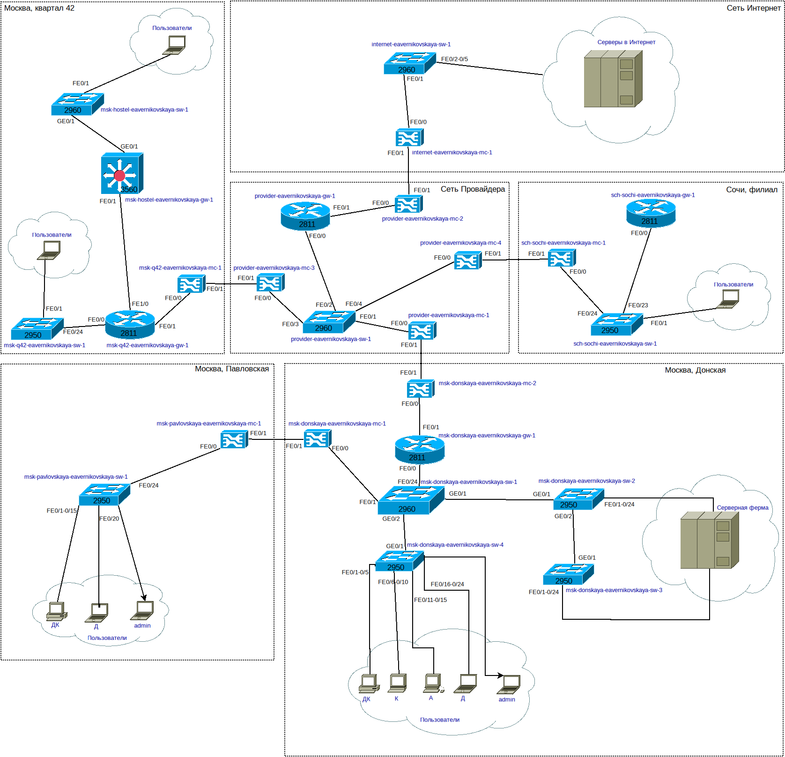{#fig-001 width=50%}

## Работа в DIA

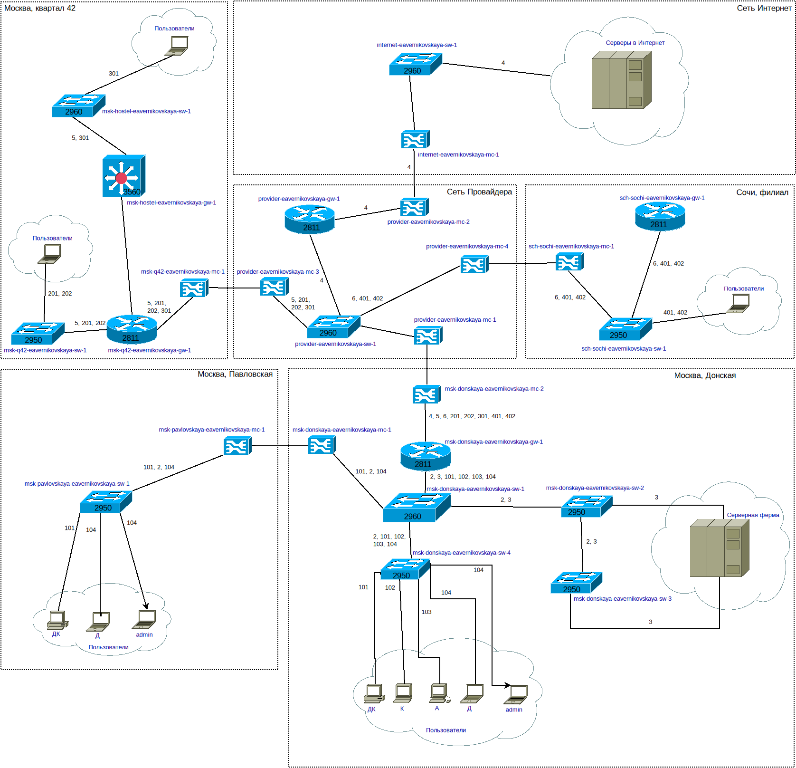{#fig-002 width=50%}

## Работа в DIA

{#fig-003 width=50%}

## Работа в Cisco Packet Tracer

{#fig-004 width=90%}

## Работа в Cisco Packet Tracer

{#fig-005 width=90%}

## Работа в Cisco Packet Tracer

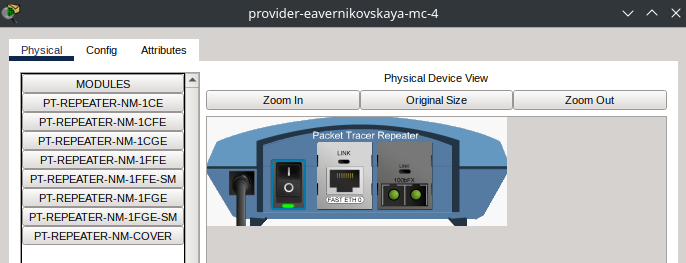{#fig-006 width=90%}

## Работа в Cisco Packet Tracer

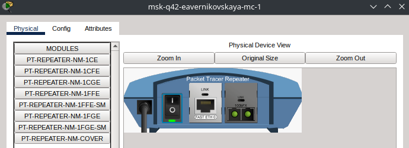{#fig-007 width=90%}

## Работа в Cisco Packet Tracer

{#fig-008 width=90%}

## Работа в Cisco Packet Tracer

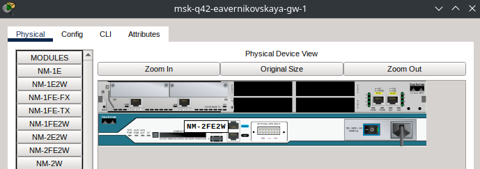{#fig-009 width=90%}

## Работа в Cisco Packet Tracer

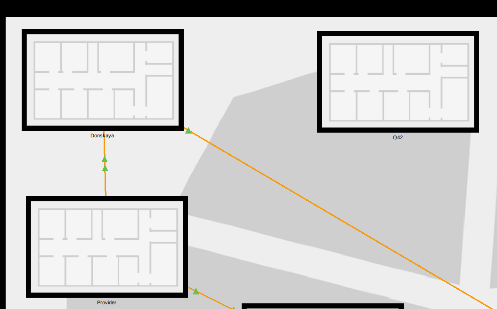{#fig-010 width=70%}

## Работа в Cisco Packet Tracer

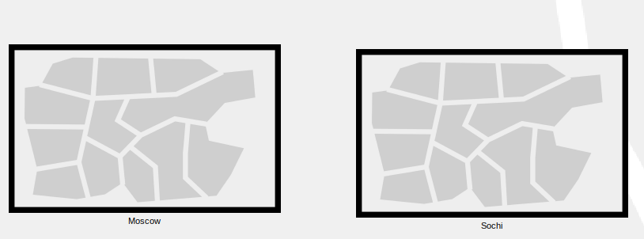{#fig-011 width=70%}

## Работа в Cisco Packet Tracer

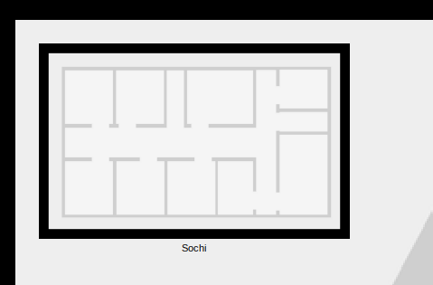{#fig-012 width=70%}

## Работа в Cisco Packet Tracer

{#fig-013 width=50%}

## Работа в Cisco Packet Tracer

{#fig-014 width=50%}

## Работа в Cisco Packet Tracer

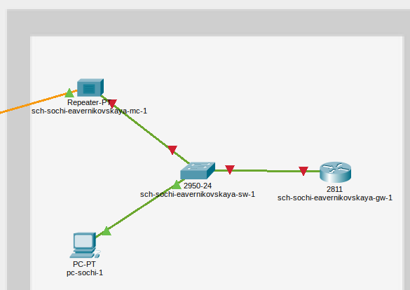{#fig-015 width=70%}

## Работа в Cisco Packet Tracer

{#fig-016 width=90%}

## Работа в Cisco Packet Tracer

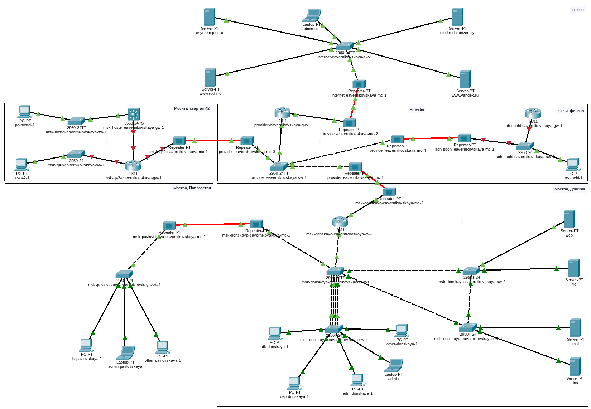{#fig-017 width=70%}

## Первоначальная настройка добавленного в проект оборудования

{#fig-018 width=55%}

## Первоначальная настройка добавленного в проект оборудования

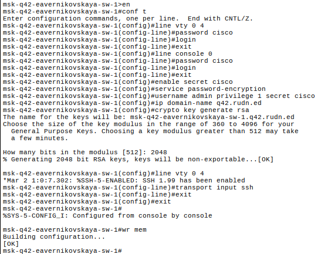{#fig-019 width=60%}

## Первоначальная настройка добавленного в проект оборудования

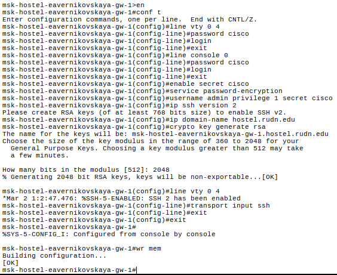{#fig-020 width=50%}

## Первоначальная настройка добавленного в проект оборудования

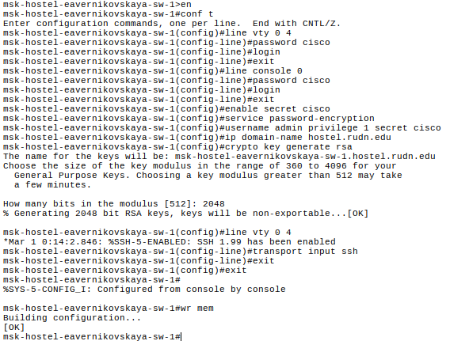{#fig-021 width=60%}

## Первоначальная настройка добавленного в проект оборудования

{#fig-022 width=60%}

## Первоначальная настройка добавленного в проект оборудования

{#fig-023 width=50%}

# Подведение итогов

## Выводы

В ходе выполнения лабораторной работы №13 мы провели подготовительные мероприятия по организации взаимодействия через сеть провайдера посредством статической маршрутизации локальной сети с сетью основного здания, расположенного в 42-м квартале в Москве, и сетью филиала, расположенного в г. Сочи

## Список литературы

1. [Лаборатораня работа №13](https://esystem.rudn.ru/pluginfile.php/3093925/mod_resource/content/12/013-static-routing-planning.pdf)
