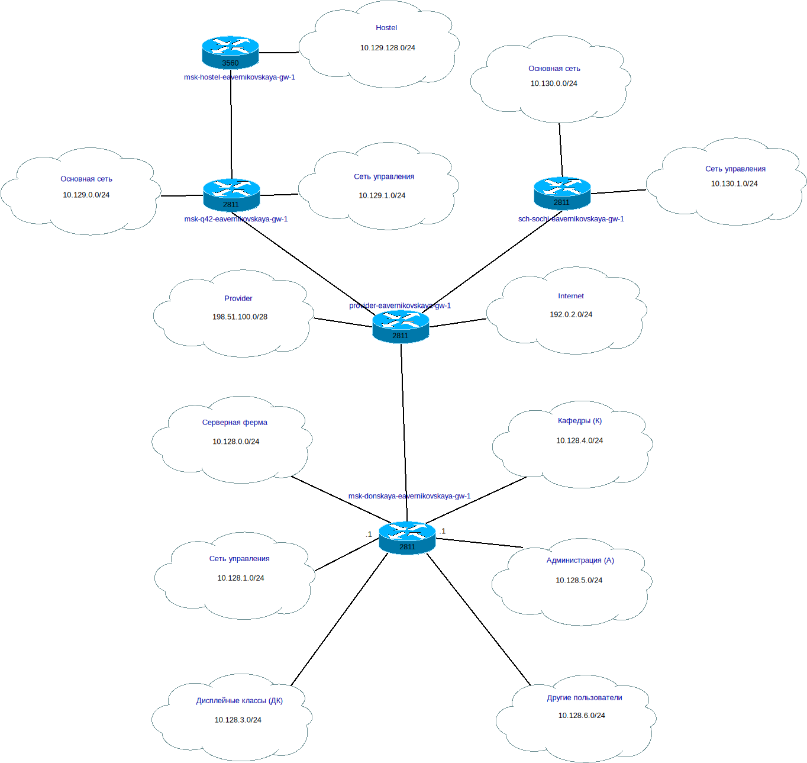
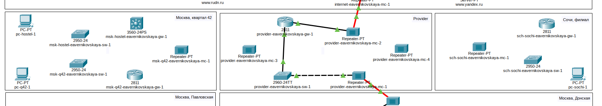
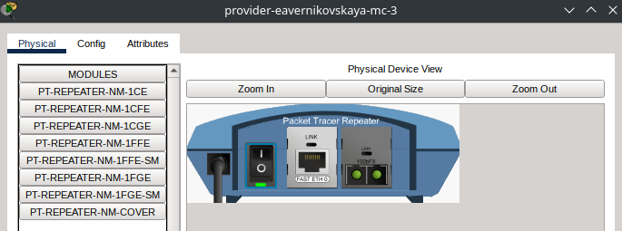
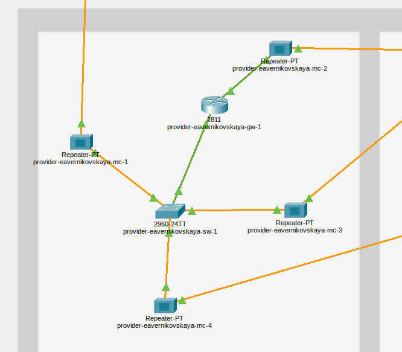
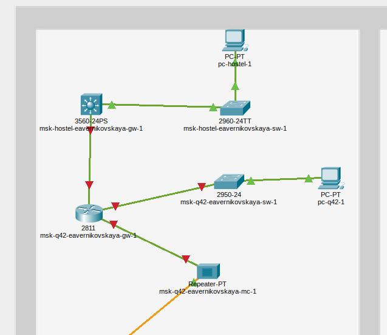
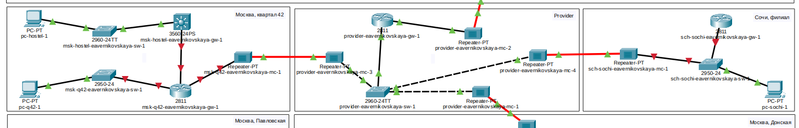
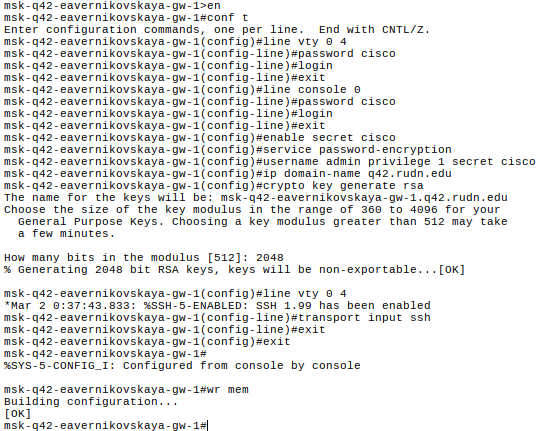
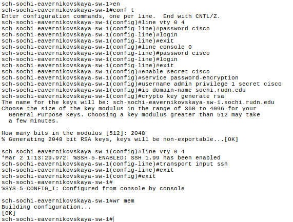
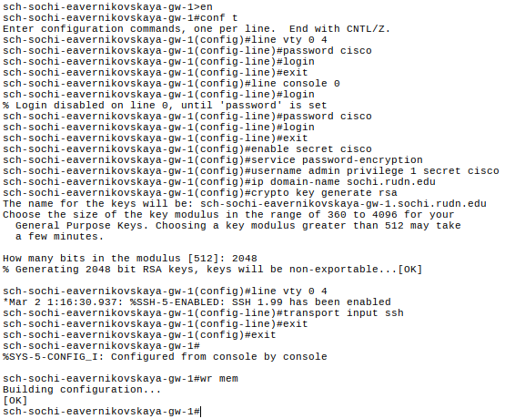

---
## Author
author:
  name: Верниковская Екатерина Андреевна
  degrees: DSc
  orcid: 0000-0002-0877-7063
  email: kulyabov-ds@rudn.ru
  affiliation:
    - name: Российский университет дружбы народов
      country: Российская Федерация
      postal-code: 117198
      city: Москва
      address: ул. Миклухо-Маклая, д. 6

## Title
title: "Отчёт по лабораторной работе №13"
subtitle: "Дисциплина: Администрирование локальных сетей"
license: "CC BY"
---

# Цель работы

Цель данной работы - провести подготовительные мероприятия по организации взаимодействия через сеть провайдера посредством статической маршрутизации локальной сети с сетью основного здания, расположенного в 42-м квартале в Москве, и сетью филиала, расположенного в г. Сочи.

# Задание

1. Внести изменения в схемы L1, L2 и L3 сети, добавив в них информацию о сети основной территории (42-й квартал в Москве) и сети филиала в г. Сочи
2. Дополнить схему проекта, добавив подсеть основной территории организации 42-го квартала в Москве и подсеть филиала в г. Сочи
3. Сделать первоначальную настройку добавленного в проект оборудования

# Выполнение лабораторной работы

Модельные предположения:

- Сеть основной территории организации, состоящая из главного здания и общежитий, расположена в 42-м квартале в Москве:
	+ подключение к сети провайдера осуществляется по оптоволокну через медиаконвертер msk-q42-eavernikovskaya-mc-1 и маршрутизатор msk-q42-eavernikovskaya-gw-1 по Fast Ethernet
	+ к маршрутизатору по Fast Ethernet подключён коммутатор msk-q42-eavernikovskaya-sw-1, через который работает локальная подсеть здания (имитируем её через PC-PT pc-q42-1)
	+  подсети общежитий подключаются по Fast Ethernet к маршрутизатору msk-q42-eavernikovskaya-gw-1 через маршрутизирующий коммутатор Cisco 3560 msk-hostel-eavernikovskaya-gw-1 посредством коммутатора msk-hostel-eavernikovskaya-sw-1 (имитируем через PC-PT pc-hostel-1)

- Филиал организации расположен в г. Сочи:
	+ подключение к сети провайдера осуществляется по оптоволокну через медиаконвертер sch-sochi-eavernikovskaya-mc-1, коммутатор sch-sochi-eavernikovskaya-sw-1 и маршрутизатор с одним интерфейсом sch-sochi-eavernikovskaya-gw-1 по Fast Ethernet
	+ локальную подсеть филиала имитируем через PC-PT pc-sochi-1
	
Названия VLAN и выделяемое адресное пространство указано в (табл. \ref{table:vlan} - \ref{table:ip3})

\begin{table}[H]
\centering
\footnotesize
\caption{Таблица VLAN сети основной территории и сети филиала в г. Сочи}
\label{table:vlan}
\begin{tabular}{|p{3cm}|p{3cm}|p{6cm}|}
\hline
\textbf{№ VLAN} & \textbf{Имя VLAN} & \textbf{Примечание} \\ \hline
1 & default & Не используется \\ \hline
2 & management & Для управления устройствами \\ \hline
3 & servers & Для серверной фермы \\ \hline
4 & nat & Линк в Интернет \\ \hline
5 & q42 & Линк в сеть квартала 42 в Москве \\ \hline
6 & sochi & Линк в сеть филиала в Сочи \\ \hline
101 & dk & Дисплейные классы (ДК) \\ \hline
102 & departments & Кафедры \\ \hline
103 & adm & Администрация \\ \hline
104 & other & Для других пользователей \\ \hline
201 & q42-main & Основной для квартала 42 в Москве\\ \hline
202 & q42-management & Для управления устройствами 42-го квартала в Москве \\ \hline
301 & hostel-main & Основной для общежитий в квартале 42 в Москве \\ \hline
401 & sochi-main & Основной для филиала в Сочи \\ \hline
402 & sochi-management & Для управления устройствами в филиале в Сочи \\ \hline
\end{tabular}
\end{table}

\begin{table}[H]
\centering
\footnotesize
\caption{Таблица IP для связующих разные территории линков}
\label{table:ip1}
\begin{tabular}{|p{3cm}|p{6cm}|p{3cm}|}
\hline
\textbf{IP-адреса} & \textbf{Примечание} & \textbf{VLAN} \\ \hline
10.128.255.0/24 & Вся сеть для линков & \\ \hline
10.128.255.0/30 & Линк на 42-й квартал & 5 \\ \hline
10.128.255.1 & msk-donskaya-eavernikovskaya-gw-1 & \\ \hline
10.128.255.2 & msk-q42-eavernikovskaya-gw-1 & \\ \hline
10.128.255.4/30 & Линк в Сочи & 6 \\ \hline
10.128.255.5 & msk-donskaya-eavernikovskaya-gw-1 & \\ \hline
10.128.255.6 & sch-sochi-eavernikovskaya-gw-1 & \\ \hline
\end{tabular}
\end{table}

\begin{table}[H]
\centering
\footnotesize
\caption{Таблица IP для сети основной территории (42-й квартал г. Москва)}
\label{table:ip2}
\begin{tabular}{|p{3cm}|p{6cm}|p{3cm}|}
\hline
\textbf{IP-адреса} & \textbf{Примечание} & \textbf{VLAN} \\ \hline
10.129.0.0/16 & Вся сеть квартала 42 в Москве & \\ \hline
10.129.0.0/24 & Основная сеть квартала 42 в Москве & 201 \\ \hline
10.129.0.1 & msk-q42-eavernikovskaya-gw-1 & \\ \hline
10.129.0.200 & pc-q42-1 & \\ \hline
10.129.1.0/24 & Сеть для управления устройствами в сети квартала 42 в Москве & 202 \\ \hline
10.129.1.1 & msk-q42-eavernikovskaya-gw-1 & \\ \hline
10.129.1.2 & msk-hostel-eavernikovskaya-gw-1 & \\ \hline
10.129.128.0/17 & Вся сеть hostel & \\ \hline
10.129.128.0/24 & Основная сеть hostel & 301 \\ \hline
10.129.128.1 & msk-hostel-eavernikovskaya-gw-1 & \\ \hline
10.129.128.200 & pc-hostel-1 & \\ \hline
\end{tabular}
\end{table}

\begin{table}[H]
\centering
\footnotesize
\caption{Таблица IP для филиала в г. Сочи}
\label{table:ip3}
\begin{tabular}{|p{3cm}|p{6cm}|p{3cm}|}
\hline
\textbf{IP-адреса} & \textbf{Примечание} & \textbf{VLAN} \\ \hline
10.130.0.0/16 & Вся сеть филиала в Сочи & \\ \hline
10.130.0.0/24 & Основная сеть филиала в Сочи & 401 \\ \hline
10.130.0.1 &  sch-sochi-eavernikovskaya-gw-1 & \\ \hline
10.130.0.200 & pc-sochi-1 & \\ \hline
10.130.1.0/24 & Сеть для управления устройствами в Сочи & 402 \\ \hline
10.130.1.1 & sch-sochi-eavernikovskaya-gw-1 & \\ \hline
\end{tabular}
\end{table}

## Работа в DIA

Внесли изменения в схемы L1, L2 и L3 сети, добавив в них информацию о сети основной территории (42-й квартал в Москве) и сети филиала в г. Сочи ([рис. @fig-001]), ([рис. @fig-002]), ([рис. @fig-003])

{#fig-001 width=70%}

{#fig-002 width=70%}

{#fig-003 width=70%}

## Работа в Cisco Packet Tracer

На схеме предыдущего проекта разместили необходимое оборудование:  4 медиаконвертера (Repeater-PT), 2 маршрутизатора типа Cisco 2811, 1 маршрутизирующий коммутатор типа Cisco 3560-24PS, 2 коммутатора типа Cisco 2950-24, коммутатор Cisco 2960-24TT, 3 оконечных устройства типа PC-PT. Присвоили имназвания ([рис. @fig-004])

{#fig-004 width=70%}

На медиаконвертерах заменили имеющиеся модули на PT-REPEATERNM-1FFE и PT-REPEATER-NM-1CFE для подключения витой пары по технологии Fast Ethernet и оптоволокна соответственно ([рис. @fig-005]), ([рис. @fig-006]), ([рис. @fig-007]), ([рис. @fig-008])

{#fig-005 width=70%}

{#fig-006 width=70%}

{#fig-007 width=70%}

{#fig-008 width=70%}

На маршрутизаторе msk-q42-eavernikovskaya-gw-1 добавили дополнительный интерфейс NM-2FE2W ([рис. @fig-009])

{#fig-009 width=70%}

В физической рабочей области Packet Tracer добавили в г. Москва здание 42-го квартала ([рис. @fig-010])

{#fig-010 width=70%}

В физической рабочей области Packet Tracer добавили город Сочи ([рис. @fig-011]) и в нём здание филиала ([рис. @fig-012])

{#fig-011 width=70%}

{#fig-012 width=70%}

Перенесли из сети «Донская» оборудование сети провайдера (provider-eavernikovskaya-mc-3 и provider-eavernikovskaya-mc-4) в соответствующее здание ([рис. @fig-013])

{#fig-013 width=70%}

Перенесите из сети «Донская» оборудование сети 42-го квартала и сети филиала в соответствующие здания ([рис. @fig-014]), ([рис. @fig-015])

{#fig-014 width=70%}

{#fig-015 width=70%}

Далее првели соединение объектов согласно скорректированной нами схеме L1 ([рис. @fig-016]), ([рис. @fig-017])

{#fig-016 width=70%}

{#fig-017 width=70%}
 
## Первоначальная настройка добавленного в проект оборудования

Проверили первоначальную настройку маршрутизатора msk-q42-eavernikovskaya-gw-1 (настроили доступ по паролю, telnet и ssh) ([рис. @fig-018]): 

```
msk-q42-eavernikovskaya-gw-1>enable
msk-q42-eavernikovskaya-gw-1#configure terminal
msk-q42-eavernikovskaya-gw-1(config)#line vty 0 4
msk-q42-eavernikovskaya-gw-1(config-line)#password cisco
msk-q42-eavernikovskaya-gw-1(config-line)#login
msk-q42-eavernikovskaya-gw-1(config-line)#exit
msk-q42-eavernikovskaya-gw-1(config)#line console 0
msk-q42-eavernikovskaya-gw-1(config-line)#password cisco
msk-q42-eavernikovskaya-gw-1(config-line)#login
msk-q42-eavernikovskaya-gw-1(config-line)#exit
msk-q42-eavernikovskaya-gw-1(config)#enable secret cisco
msk-q42-eavernikovskaya-gw-1(config)#service password-encryption
msk-q42-eavernikovskaya-gw-1(config)#username admin privilege 1 secret cisco
msk-q42-eavernikovskaya-gw-1(config)#ip domain-name q42.rudn.edu
msk-q42-eavernikovskaya-gw-1(config)#crypto key generate rsa
msk-q42-eavernikovskaya-gw-1(config)#line vty 0 4
msk-q42-eavernikovskaya-gw-1(config-line)#transport input ssh
```

{#fig-018 width=70%}

Проверили первоначальную настройку коммутатора msk-q42-eavernikovskaya-sw-1 (настроили доступ по паролю, telnet и ssh) ([рис. @fig-019]): 

```
msk-q42-eavernikovskaya-sw-1>enable
msk-q42-eavernikovskaya-sw-1#configure terminal
msk-q42-eavernikovskaya-sw-1(config)#line vty 0 4
msk-q42-eavernikovskaya-sw-1(config-line)#password cisco
msk-q42-eavernikovskaya-sw-1(config-line)#login
msk-q42-eavernikovskaya-sw-1(config-line)#exit
msk-q42-eavernikovskaya-sw-1(config)#line console 0
msk-q42-eavernikovskaya-sw-1(config-line)#password cisco
msk-q42-eavernikovskaya-sw-1(config-line)#login
msk-q42-eavernikovskaya-sw-1(config-line)#exit
msk-q42-eavernikovskaya-sw-1(config)#enable secret cisco
msk-q42-eavernikovskaya-sw-1(config)#service password-encryption
msk-q42-eavernikovskaya-sw-1(config)#username admin privilege 1 secret cisco
msk-q42-eavernikovskaya-sw-1(config)#ip domain-name q42.rudn.edu
msk-q42-eavernikovskaya-sw-1(config)#crypto key generate rsa
msk-q42-eavernikovskaya-sw-1(config)#line vty 0 4
msk-q42-eavernikovskaya-sw-1(config-line)#transport input ssh
```

{#fig-019 width=70%}

Проверили первоначальную настройку маршрутизирующего коммутатора msk-hostel-eavernikovskaya-gw-1 (настроили доступ по паролю, telnet и ssh) ([рис. @fig-020]): 

```
msk-hostel-eavernikovskaya-gw-1>enable
msk-hostel-eavernikovskaya-gw-1#configure terminal
msk-hostel-eavernikovskaya-gw-1(config)#line vty 0 4
msk-hostel-eavernikovskaya-gw-1(config-line)#password cisco
msk-hostel-eavernikovskaya-gw-1(config-line)#login
msk-hostel-eavernikovskaya-gw-1(config-line)#exit
msk-hostel-eavernikovskaya-gw-1(config)#line console 0
msk-hostel-eavernikovskaya-gw-1(config-line)#password cisco
msk-hostel-eavernikovskaya-gw-1(config-line)#login
msk-hostel-eavernikovskaya-gw-1(config-line)#exit
msk-hostel-eavernikovskaya-gw-1(config)#enable secret cisco
msk-hostel-eavernikovskaya-gw-1(config)#service password-encryption
msk-hostel-eavernikovskaya-gw-1(config)#username admin privilege 1 secret cisco
msk-hostel-eavernikovskaya-gw-1(config)#ip ssh version 2
msk-hostel-eavernikovskaya-gw-1(config)#ip domain-name hostel.rudn.edu
msk-hostel-eavernikovskaya-gw-1(config)#crypto key generate rsa
msk-hostel-eavernikovskaya-gw-1(config)#line vty 0 4
msk-hostel-eavernikovskaya-gw-1(config-line)#transport input ssh
```

{#fig-020 width=70%}

Проверили первоначальную настройку коммутатора msk-hostel-eavernikovskaya-sw-1 (настроили доступ по паролю, telnet и ssh) ([рис. @fig-021]): 

```
msk-hostel-eavernikovskaya-sw-1>enable
msk-hostel-eavernikovskaya-sw-1#configure terminal
msk-hostel-eavernikovskaya-sw-1(config)#line vty 0 4
msk-hostel-eavernikovskaya-sw-1(config-line)#password cisco
msk-hostel-eavernikovskaya-sw-1(config-line)#login
msk-hostel-eavernikovskaya-sw-1(config-line)#exit
msk-hostel-eavernikovskaya-sw-1(config)#line console 0
msk-hostel-eavernikovskaya-sw-1(config-line)#password cisco
msk-hostel-eavernikovskaya-sw-1(config-line)#login
msk-hostel-eavernikovskaya-sw-1(config-line)#exit
msk-hostel-eavernikovskaya-sw-1(config)#enable secret cisco
msk-hostel-eavernikovskaya-sw-1(config)#service password-encryption
msk-hostel-eavernikovskaya-sw-1(config)#username admin privilege 1 secret cisco
msk-hostel-eavernikovskaya-sw-1(config)#ip domain-name hostel.rudn.edu
msk-hostel-eavernikovskaya-sw-1(config)#crypto key generate rsa
msk-hostel-eavernikovskaya-sw-1(config)#line vty 0 4
msk-hostel-eavernikovskaya-sw-1(config-line)#transport input ssh
```

{#fig-021 width=70%}

Проверили первоначальную настройку коммутатора sch-sochi-eavernikovskaya-sw-1 (настроили доступ по паролю, telnet и ssh) ([рис. @fig-022]): 

```
sch-sochi-eavernikovskaya-sw-1>enable
sch-sochi-eavernikovskaya-sw-1#configure terminal
sch-sochi-eavernikovskaya-sw-1(config)#line vty 0 4
sch-sochi-eavernikovskaya-sw-1(config-line)#password cisco
sch-sochi-eavernikovskaya-sw-1(config-line)#login
sch-sochi-eavernikovskaya-sw-1(config-line)#exit
sch-sochi-eavernikovskaya-sw-1(config)#line console 0
sch-sochi-eavernikovskaya-sw-1(config-line)#password cisco
sch-sochi-eavernikovskaya-sw-1(config-line)#login
sch-sochi-eavernikovskaya-sw-1(config-line)#exit
sch-sochi-eavernikovskaya-sw-1(config)#enable secret cisco
sch-sochi-eavernikovskaya-sw-1(config)#service password-encryption
sch-sochi-eavernikovskaya-sw-1(config)#username admin privilege 1 secret cisco
sch-sochi-eavernikovskaya-sw-1(config)#ip domain-name sochi.rudn.edu
sch-sochi-eavernikovskaya-sw-1(config)#crypto key generate rsa
sch-sochi-eavernikovskaya-sw-1(config)#line vty 0 4
sch-sochi-eavernikovskaya-sw-1(config-line)#transport input ssh
```

{#fig-022 width=70%}

Проверили первоначальную настройку маршрутизатора sch-sochi-eavernikovskaya-gw-1 (настроили доступ по паролю, telnet и ssh) ([рис. @fig-023]): 

```
sch-sochi-eavernikovskaya-gw-1>enable
sch-sochi-eavernikovskaya-gw-1#configure terminal
sch-sochi-eavernikovskaya-gw-1(config)#line vty 0 4
sch-sochi-eavernikovskaya-gw-1(config-line)#password cisco
sch-sochi-eavernikovskaya-gw-1(config-line)#login
sch-sochi-eavernikovskaya-gw-1(config-line)#exit
sch-sochi-eavernikovskaya-gw-1(config)#line console 0
sch-sochi-eavernikovskaya-gw-1(config-line)#password cisco
sch-sochi-eavernikovskaya-gw-1(config-line)#login
sch-sochi-eavernikovskaya-gw-1(config-line)#exit
sch-sochi-eavernikovskaya-gw-1(config)#enable secret cisco
sch-sochi-eavernikovskaya-gw-1(config)#service password-encryption
sch-sochi-eavernikovskaya-gw-1(config)#username admin privilege 1 secret cisco
sch-sochi-eavernikovskaya-gw-1(config)#ip domain-name sochi.rudn.edu
sch-sochi-eavernikovskaya-gw-1(config)#crypto key generate rsa
sch-sochi-eavernikovskaya-gw-1(config)#line vty 0 4
sch-sochi-eavernikovskaya-gw-1(config-line)#transport input ssh
```

{#fig-023 width=70%}

## Контрольные вопросы + ответы

1. В каких случаях следует использовать статическую маршрутизацию? Приведите примеры.

В реальных условиях статическая маршрутизация используется в условиях наличия шлюза по умолчанию (узла, обладающего связностью с остальными узлами) и 1-2 сетями. Помимо этого, статическая маршрутизация используется для «выравнивания» работы маршрутизирующих протоколов в условиях наличия туннеля (для того, чтобы маршрутизация трафика, создаваемого туннелем, не производилась через сам туннель)

2. Укажите основные принципы статической маршрутизации между VLANs.

Процесс маршрутизации на 3-м уровне можно осуществлять с помощью маршрутизатора или коммутатора 3-го уровня. Использование устройства 3- го уровня обеспечивает возможность управления передачей трафика между сегментами сети, в том числе сегментами, которые были созданы с помощью VLAN

# Выводы

В ходе выполнения лабораторной работы №13 мы провели подготовительные мероприятия по организации взаимодействия через сеть провайдера посредством статической маршрутизации локальной сети с сетью основного здания, расположенного в 42-м квартале в Москве, и сетью филиала, расположенного в г. Сочи.

# Список литературы

1. [Лаборатораня работа №13](https://esystem.rudn.ru/pluginfile.php/3093925/mod_resource/content/12/013-static-routing-planning.pdf)
