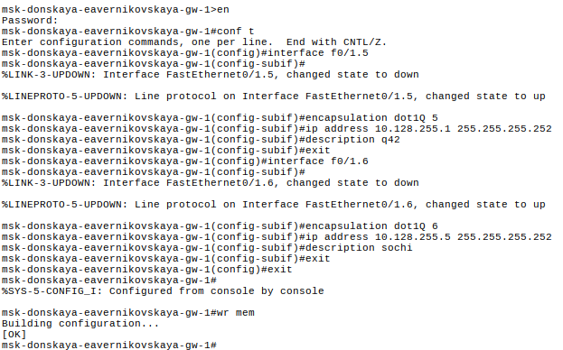
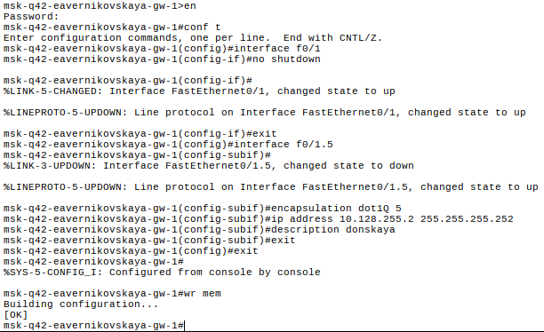
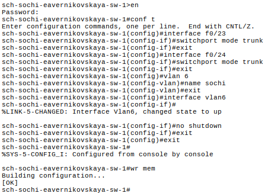
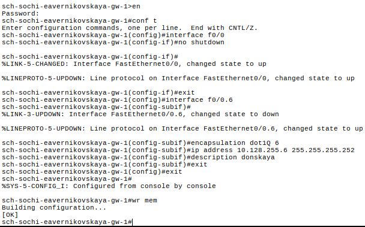
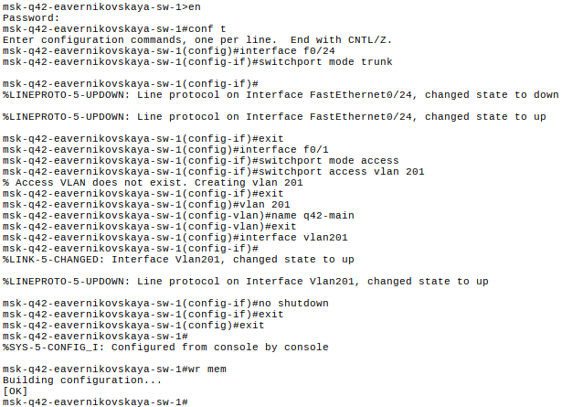
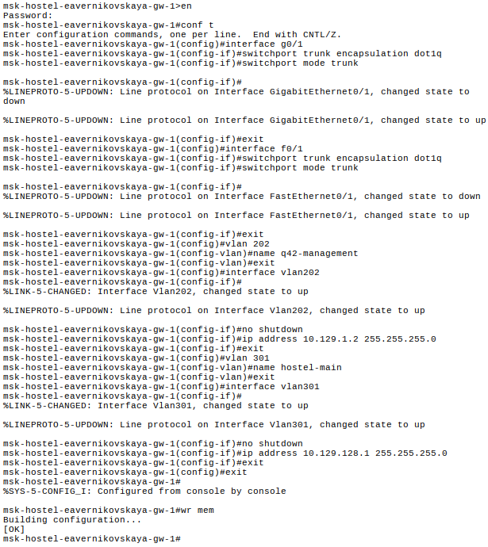
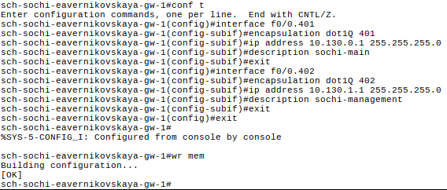
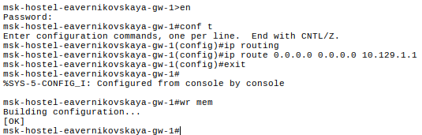

---
## Author
author:
  name: Верниковская Екатерина Андреевна
  degrees: DSc
  orcid: 0000-0002-0877-7063
  email: kulyabov-ds@rudn.ru
  affiliation:
    - name: Российский университет дружбы народов
      country: Российская Федерация
      postal-code: 117198
      city: Москва
      address: ул. Миклухо-Маклая, д. 6

## Title
title: "Отчёт по лабораторной работе №14"
subtitle: "Дисциплина: Администрирование локальных сетей"
license: "CC BY"
---

# Цель работы

Цель данной работы - настроить взаимодействие через сеть провайдера посредством статической маршрутизации локальной сети организации с сетью основного здания, расположенного в 42-м квартале в Москве, и сетью филиала, расположенного в г. Сочи

# Задание

1. Настроить связь между территориями
2. Настроить оборудование, расположенное в квартале 42 в Москве
3. Настроить оборудование, расположенное в филиале в г. Сочи
4. Настроить статическую маршрутизацию между территориями
5. Настроить статическую маршрутизацию на территории квартала 42 в г. Москве
6. Настроить NAT на маршрутизаторе msk-donskaya-eavernikovskaya-gw-1

# Выполнение лабораторной работы

## Настройка линка между площадками

Настроили интерфейсы коммутатора provider-eavernikovskaya-sw-1. Подняли и сделали интерфейсы f0/3 и f0/4 транковыми ([рис. @fig-001])

```
provider-eavernikovskaya-sw-1>enable
provider-eavernikovskaya-sw-1#configure terminal
provider-eavernikovskaya-sw-1(config)#interface f0/3
provider-eavernikovskaya-sw-1(config-if)#switchport mode trunk
provider-eavernikovskaya-sw-1(config-if)#exit
provider-eavernikovskaya-sw-1(config)#interface f0/4
provider-eavernikovskaya-sw-1(config-if)#switchport mode trunk
provider-eavernikovskaya-sw-1(config-if)#exit
provider-eavernikovskaya-sw-1(config)#vlan 5
provider-eavernikovskaya-sw-1(config-vlan)#name q42
provider-eavernikovskaya-sw-1(config-vlan)#exit
provider-eavernikovskaya-sw-1(config)#interface vlan5
provider-eavernikovskaya-sw-1(config-if)#no shutdown
provider-eavernikovskaya-sw-1(config-if)#exit
provider-eavernikovskaya-sw-1(config)#vlan 6
provider-eavernikovskaya-sw-1(config-vlan)#name sochi
provider-eavernikovskaya-sw-1(config-vlan)#exit
provider-eavernikovskaya-sw-1(config)#interface vlan6
provider-eavernikovskaya-sw-1(config-if)#no shutdown
provider-eavernikovskaya-sw-1(config-if)#exit
```

{#fig-001 width=70%}

Далее настроили интерфейсы маршрутизатора msk-donskaya-eavernikovskaya-gw-1. Создали сабинтерфейсы f0/1.5 и f0/1.6 для 5 и 6 vlan, задали ip-адреса маршрутизатора в них ([рис. @fig-002])

```
msk-donskaya-eavernikovskaya-gw-1>enable
msk-donskaya-eavernikovskaya-gw-1#configure terminal
msk-donskaya-eavernikovskaya-gw-1(config)#interface f0/1.5
msk-donskaya-eavernikovskaya-gw-1(config-subif)#encapsulation dot1Q 5
msk-donskaya-eavernikovskaya-gw-1(config-subif)#ip address 10.128.255.1 255.255.255.252
msk-donskaya-eavernikovskaya-gw-1(config-subif)#description q42
msk-donskaya-eavernikovskaya-gw-1(config-subif)#exit
msk-donskaya-eavernikovskaya-gw-1(config)#interface f0/1.6
msk-donskaya-eavernikovskaya-gw-1(config-subif)#encapsulation dot1Q 6
msk-donskaya-eavernikovskaya-gw-1(config-subif)#ip address 10.128.255.5 255.255.255.252
msk-donskaya-eavernikovskaya-gw-1(config-subif)#description sochi
msk-donskaya-eavernikovskaya-gw-1(config-subif)#exit
```

{#fig-002 width=70%}

Настроили интерфейсы маршрутизатора msk-q42-eavernikovskaya-gw-1. Подняли интерфейс f0/1, создали сабинтерфейс f0/1.5 для 5 vlan и задали ip-адрес ([рис. @fig-003])

```
msk-q42-eavernikovskaya-gw-1>enable
msk-q42-eavernikovskaya-gw-1#configure terminal
msk-q42-eavernikovskaya-gw-1(config)#interface f0/1
msk-q42-eavernikovskaya-gw-1(config-if)#no shutdown
msk-q42-eavernikovskaya-gw-1(config-if)#exit
msk-q42-eavernikovskaya-gw-1(config)#interface f0/1.5
msk-q42-eavernikovskaya-gw-1(config-subif)#encapsulation dot1Q 5
msk-q42-eavernikovskaya-gw-1(config-subif)#ip address 10.128.255.2 255.255.255.252
msk-q42-eavernikovskaya-gw-1(config-subif)#description donskaya
msk-q42-eavernikovskaya-gw-1(config-subif)#exit
msk-q42-eavernikovskaya-gw-1(config)#exit
```

{#fig-003 width=70%}

Настроили интерфейсы коммутатора sch-sochi-eavernikovskaya-sw-1. Сделали интерфейсы f0/23 и f0/24 транковыми, задали 6 vlan с именем sochi ([рис. @fig-004])

```
sch-sochi-eavernikovskaya-sw-1>enable
sch-sochi-eavernikovskaya-sw-1#configure terminal
sch-sochi-eavernikovskaya-sw-1(config)#interface f0/23
sch-sochi-eavernikovskaya-sw-1(config-if)#switchport mode trunk
sch-sochi-eavernikovskaya-sw-1(config-if)#exit
sch-sochi-eavernikovskaya-sw-1(config)#interface f0/24
sch-sochi-eavernikovskaya-sw-1(config-if)#switchport mode trunk
sch-sochi-eavernikovskaya-sw-1(config-if)#exit
sch-sochi-eavernikovskaya-sw-1(config)#vlan 6
sch-sochi-eavernikovskaya-sw-1(config-vlan)#name sochi
sch-sochi-eavernikovskaya-sw-1(config-vlan)#exit
sch-sochi-eavernikovskaya-sw-1(config)#interface vlan6
sch-sochi-eavernikovskaya-sw-1(config-if)#no shutdown
sch-sochi-eavernikovskaya-sw-1(config-if)#exit
```

{#fig-004 width=70%}

Далее настроили интерфейсы маршрутизатора sch-sochi-eavernikovskaya-gw-1. Подняли интерфейс f0/0, создали сабинтерфейс f0/0.6 для 6 vlan и задали ip-адрес ([рис. @fig-005])

```
sch-sochi-eavernikovskaya-gw-1>enable
sch-sochi-eavernikovskaya-gw-1#configure terminal
sch-sochi-eavernikovskaya-gw-1(config)#interface f0/0
sch-sochi-eavernikovskaya-gw-1(config-if)#no shutdown
sch-sochi-eavernikovskaya-gw-1(config-if)#exit
sch-sochi-eavernikovskaya-gw-1(config)#interface f0/0.6
sch-sochi-eavernikovskaya-gw-1(config-subif)#encapsulation dot1Q 6
sch-sochi-eavernikovskaya-gw-1(config-subif)#ip address 10.128.255.6 255.255.255.252
sch-sochi-eavernikovskaya-gw-1(config-subif)#description donskaya
sch-sochi-eavernikovskaya-gw-1(config-subif)#exit
sch-sochi-eavernikovskaya-gw-1(config)#exit
```

{#fig-005 width=70%}

## Настройка площадки 42-го квартала

Настроили интерфейсы маршрутизатора msk-q42-eavernikovskaya-gw-1. Подняли интерфейсы f0/0 и f1/0, создали сабинтерфейсы f0/0.201 для 201 vlan (основной на этой территории) и f1/0.202 для 202 vlan (для управления устройствами на этой территории) и задали ip-адреса маршрутизатора в них ([рис. @fig-006])

```
msk-q42-eavernikovskaya-gw-1>enable
msk-q42-eavernikovskaya-gw-1#configure terminal
msk-q42-eavernikovskaya-gw-1(config)#interface f0/0
msk-q42-eavernikovskaya-gw-1(config-if)#no shutdown
msk-q42-eavernikovskaya-gw-1(config-if)#exit
msk-q42-eavernikovskaya-gw-1(config)#interface f0/0.201
msk-q42-eavernikovskaya-gw-1(config-subif)#encapsulation dot1Q 201
msk-q42-eavernikovskaya-gw-1(config-subif)#ip address 10.129.0.1 255.255.255.0
msk-q42-eavernikovskaya-gw-1(config-subif)#description q42−main
msk-q42-eavernikovskaya-gw-1(config-subif)#exit
msk-q42-eavernikovskaya-gw-1(config)#interface f1/0
msk-q42-eavernikovskaya-gw-1(config-if)#no shutdown
msk-q42-eavernikovskaya-gw-1(config-if)#exit
msk-q42-eavernikovskaya-gw-1(config)#interface f1/0.202
msk-q42-eavernikovskaya-gw-1(config-subif)#encapsulation dot1Q 202
msk-q42-eavernikovskaya-gw-1(config-subif)#ip address 10.129.1.1 255.255.255.0
msk-q42-eavernikovskaya-gw-1(config-subif)#description q42−management
msk-q42-eavernikovskaya-gw-1(config-subif)#exit
```

{#fig-006 width=70%}

Далее настроили интерфейсы коммутатора msk-q42-eavernikovskaya-sw-1. Сделали интерфейс f0/24 транковым, оконечному устройству задали доступ по f0/1 к 201 vlan ([рис. @fig-007])

```
msk-q42-eavernikovskaya-sw-1>enable
msk-q42-eavernikovskaya-sw-1#configure terminal
msk-q42-eavernikovskaya-sw-1(config)#interface f0/24
msk-q42-eavernikovskaya-sw-1(config-if)#switchport mode trunk
msk-q42-eavernikovskaya-sw-1(config-if)#exit
msk-q42-eavernikovskaya-sw-1(config)#interface f0/1
msk-q42-eavernikovskaya-sw-1(config-if)#switchport mode access
msk-q42-eavernikovskaya-sw-1(config-if)#switchport access vlan 201
msk-q42-eavernikovskaya-sw-1(config-if)#exit
msk-q42-eavernikovskaya-sw-1(config)#vlan 201
msk-q42-eavernikovskaya-sw-1(config-vlan)#name q42-main
msk-q42-eavernikovskaya-sw-1(config-vlan)#exit
msk-q42-eavernikovskaya-sw-1(config)#interface vlan201
msk-q42-eavernikovskaya-sw-1(config-if)#no shutdown
msk-q42-eavernikovskaya-sw-1(config-if)#exit
```

{#fig-007 width=70%}

Настроили интерфейсы маршрутизирующего коммутатора msk-hostel-eavernikovskaya-gw-1. Сделали интерфейсы g0/1 и f0/1 транковыми, создали 202 и 301 vlan и задали ip-адреса ([рис. @fig-008])

```
msk-hostel-eavernikovskaya-gw-1>enable
msk-hostel-eavernikovskaya-gw-1#configure terminal
msk-hostel-eavernikovskaya-gw-1(config)#interface g0/1
msk-hostel-eavernikovskaya-gw-1(config-if)#switchport trunk encapsulation dot1q
msk-hostel-eavernikovskaya-gw-1(config-if)#switchport mode trunk
msk-hostel-eavernikovskaya-gw-1(config-if)#exit
msk-hostel-eavernikovskaya-gw-1(config)#interface f0/1
msk-hostel-eavernikovskaya-gw-1(config-if)#switchport trunk encapsulation dot1q
msk-hostel-eavernikovskaya-gw-1(config-if)#switchport mode trunk
msk-hostel-eavernikovskaya-gw-1(config-if)#exit
msk-hostel-eavernikovskaya-gw-1(config)#vlan 202
msk-hostel-eavernikovskaya-gw-1(config-vlan)#name q42-management
msk-hostel-eavernikovskaya-gw-1(config-vlan)#exit
msk-hostel-eavernikovskaya-gw-1(config)#interface vlan202
msk-hostel-eavernikovskaya-gw-1(config-if)#no shutdown
msk-hostel-eavernikovskaya-gw-1(config-if)#ip address 10.129.1.2 255.255.255.0
msk-hostel-eavernikovskaya-gw-1(config-if)#exit
msk-hostel-eavernikovskaya-gw-1(config)#vlan 301
msk-hostel-eavernikovskaya-gw-1(config-vlan)#name hostel-main
msk-hostel-eavernikovskaya-gw-1(config-vlan)#exit
msk-hostel-eavernikovskaya-gw-1(config)#interface vlan301
msk-hostel-eavernikovskaya-gw-1(config-if)#no shutdown
msk-hostel-eavernikovskaya-gw-1(config-if)#ip address 10.129.128.1 255.255.255.0
msk-hostel-eavernikovskaya-gw-1(config-if)#exit
```

{#fig-008 width=70%}

Настроили интерфейсы коммутатора msk-hostel-eavernikovskaya-sw-1. Сделали интерфейс g0/1 транковым, оконечному устройству задали доступ по f0/1 к 301 vlan ([рис. @fig-009])

```
msk-hostel-eavernikovskaya-sw-1>enable
msk-hostel-eavernikovskaya-sw-1#configure terminal
msk-hostel-eavernikovskaya-sw-1(config)#interface g0/1
msk-hostel-eavernikovskaya-sw-1(config-if)#switchport mode trunk
msk-hostel-eavernikovskaya-sw-1(config-if)#exit
msk-hostel-eavernikovskaya-sw-1(config)#interface f0/1
msk-hostel-eavernikovskaya-sw-1(config-if)#switchport mode access
msk-hostel-eavernikovskaya-sw-1(config-if)#switchport access vlan 301
msk-hostel-eavernikovskaya-sw-1(config-if)#exit
msk-hostel-eavernikovskaya-sw-1(config)#vlan 301
msk-hostel-eavernikovskaya-sw-1(config-vlan)#name hostel-main
msk-hostel-eavernikovskaya-sw-1(config-vlan)#exit
msk-hostel-eavernikovskaya-sw-1(config)#interface vlan301
msk-hostel-eavernikovskaya-sw-1(config-if)#no shutdown
msk-hostel-eavernikovskaya-sw-1(config-if)#exit
```

{#fig-009 width=70%}

 
## Настройка площадки в Сочи

Настроили инерфейсы маршрутизатора sch-sochi-eavernikovskaya-gw-1. Создали сабинтерфейсы f0/0.401 и для 401 vlan ((основной на этой территории)) и f0/0.402 для 402 vlan (для управления устройствами на этой территории) и задали ip-адреса маршрутизатора в них ([рис. @fig-010])

```
sch-sochi-eavernikovskaya-gw-1>enable
sch-sochi-eavernikovskaya-gw-1#configure terminal
sch-sochi-eavernikovskaya-gw-1(config)#interface f0/0.401
sch-sochi-eavernikovskaya-gw-1(config-subif)#encapsulation dot1Q 401
sch-sochi-eavernikovskaya-gw-1(config-subif)#ip address 10.130.0.1 255.255.255.0
sch-sochi-eavernikovskaya-gw-1(config-subif)#description sochi-main
sch-sochi-eavernikovskaya-gw-1(config-subif)#exit
sch-sochi-eavernikovskaya-gw-1(config)#interface f0/0.402
sch-sochi-eavernikovskaya-gw-1(config-subif)#encapsulation dot1Q 402
sch-sochi-eavernikovskaya-gw-1(config-subif)#ip address 10.130.1.1 255.255.255.0
sch-sochi-eavernikovskaya-gw-1(config-subif)#description sochi-management
sch-sochi-eavernikovskaya-gw-1(config-subif)#exit
```

{#fig-010 width=70%}

Настроили интерфейсы коммутатора sch-sochi-eavernikovskaya-sw-1. Оконечному устройству задали доступ по f0/1 к 401 vlan ([рис. @fig-011])

```
sch-sochi-eavernikovskaya-sw-1>enable
sch-sochi-eavernikovskaya-sw-1#configure terminal
sch-sochi-eavernikovskaya-sw-1(config)#interface f0/1
sch-sochi-eavernikovskaya-sw-1(config-if)#switchport mode access
sch-sochi-eavernikovskaya-sw-1(config-if)#switchport access vlan 401
sch-sochi-eavernikovskaya-sw-1(config-if)#exit
sch-sochi-eavernikovskaya-sw-1(config)#vlan 401
sch-sochi-eavernikovskaya-sw-1(config-vlan)#name sochi-main
sch-sochi-eavernikovskaya-sw-1(config-vlan)#exit
sch-sochi-eavernikovskaya-sw-1(config)#interface vlan401
sch-sochi-eavernikovskaya-sw-1(config-if)#no shutdown
sch-sochi-eavernikovskaya-sw-1(config-if)#exit
```

{#fig-011 width=70%}

## Настройка маршрутизации между площадками

Задали маршруты по умолчанию для маршрутизатора на Донской - на маршрутизаторах в 42 квартале и в Сочи, а также в обратную сторону. 

Настроили маршрутизатор msk-donskaya-eavernikovskaya-gw-1 ([рис. @fig-012])

```
msk-donskaya-eavernikovskaya-gw-1>enable
msk-donskaya-eavernikovskaya-gw-1#configure terminal
msk-donskaya-eavernikovskaya-gw-1(config)#ip route 10.129.0.0 255.255.0.0 10.128.255.2
msk-donskaya-eavernikovskaya-gw-1(config)#ip route 10.130.0.0 255.255.0.0 10.128.255.6
```

{#fig-012 width=70%}

Настроили маршрутизатор msk-q42-eavernikovskaya-gw-1 ([рис. @fig-013])

```
msk-q42-eavernikovskaya-gw-1>enable
msk-q42-eavernikovskaya-gw-1#configure terminal
msk-q42-eavernikovskaya-gw-1(config)#ip route 0.0.0.0 0.0.0.0 10.128.255.1
```

{#fig-013 width=70%}

Настроили маршрутизатор sch-sochi-eavernikovskaya-gw-1 ([рис. @fig-014])

```
sch-sochi-eavernikovskaya-gw-1>enable
sch-sochi-eavernikovskaya-gw-1#configure terminal
sch-sochi-eavernikovskaya-gw-1(config)#ip route 0.0.0.0 0.0.0.0 10.128.255.5
```

{#fig-014 width=70%}

## Настройка маршрутизации на 42 квартале

Далее настроили маршруты между маршрутизаторами на 42 квартале.

Настроили маршрутизатор msk-q42-eavernikovskaya-gw-1 ([рис. @fig-015])

```
msk-q42-eavernikovskaya-gw-1>enable
msk-q42-eavernikovskaya-gw-1#configure terminal
msk-q42-eavernikovskaya-gw-1(config)#ip route 10.129.128.0 255.255.128.0 10.129.1.2
```

{#fig-015 width=70%}

Настроили интерфейсы маршрутизирующего коммутатора msk-hostel-eavernikovskaya-gw-1 ([рис. @fig-016])

```
msk-hostel-eavernikovskaya-gw-1>enable
msk-hostel-eavernikovskaya-gw-1#configure terminal
msk-hostel-eavernikovskaya-gw-1(config)#ip routing
msk-hostel-eavernikovskaya-gw-1(config)#ip route 0.0.0.0 0.0.0.0 10.129.1.1
```

{#fig-016 width=70%}

## Настройка NAT на маршрутизаторе msk-donskaya-eavernikovskaya-gw-1

Настроили NAT на маршрутизаторе msk-donskaya-eavernikovskaya-gw-1, дополнили список доступа к интернет-ресурсам (разрешили оконечным устройствам с обеих территорий доступ ко всему) ([рис. @fig-017])

```
msk-donskaya-eavernikovskaya-gw-1>enable
msk-donskaya-eavernikovskaya-gw-1#configure terminal
msk-donskaya-eavernikovskaya-gw-1(config)#interface f0/1.5
msk-donskaya-eavernikovskaya-gw-1(config-subif)#ip nat inside
msk-donskaya-eavernikovskaya-gw-1(config-subif)#exit
msk-donskaya-eavernikovskaya-gw-1(config)#interface f0/1.6
msk-donskaya-eavernikovskaya-gw-1(config-subif)#ip nat inside
msk-donskaya-eavernikovskaya-gw-1(config-subif)#exit
msk-donskaya-eavernikovskaya-gw-1(config)#ip access −list extended nat−inet
msk-donskaya-eavernikovskaya-gw-1(config-ext-nacl)#remark q42
msk-donskaya-eavernikovskaya-gw-1(config-ext-nacl)#permit ip host 10.129.0.200 any
msk-donskaya-eavernikovskaya-gw-1(config-ext-nacl)#permit ip host 10.129.128.200 any
msk-donskaya-eavernikovskaya-gw-1(config-ext-nacl)#remark sochi
msk-donskaya-eavernikovskaya-gw-1(config-ext-nacl)#permit ip host 10.130.0.200 any
msk-donskaya-eavernikovskaya-gw-1(config-ext-nacl)#exit
```

{#fig-017 width=70%}

## Контрольные вопросы + ответы

1. Приведите пример настройки статической маршрутизации между двумя подсетями организации.

Необходимо задать IP шлюзов на интерфейсах, настроить sub-интерфейсы с тегированием кадром VLANами и своими IP, затем настроить статические маршруты между сетями

2. Опишите процесс обращения устройства из одного VLAN к устройству из другого VLAN.

1 устройство посылает фрейм на маршрутизатор, тот меняет MAC исходника на свой и перенаправляет фрейм 2 устройству

3. Как проверить работоспособность маршрута?

ping на диаметрально противоположных устройствах друг к другу

4. Как посмотреть таблицу маршрутизации?

show ip route

# Выводы

В ходе выполнения лабораторной работы №14 мы настроили взаимодействие через сеть провайдера посредством статической маршрутизации локальной сети организации с сетью основного здания, расположенного в 42-м квартале в Москве, и сетью филиала, расположенного в г. Сочи

# Список литературы

1. [Лаборатораня работа №14](https://esystem.rudn.ru/pluginfile.php/3093929/mod_resource/content/12/014-static-routing.pdf)
