---
# Preamble

## Author
author:
  name: Верниковская E. A., НПИбд-01-23
  degrees: Student
  email: 11322361366@pfur.ru
  affiliation:
    - name: Российский университет дружбы народов
      country: Российская Федерация
      postal-code: 117198
      city: Москва
      address: ул. Миклухо-Маклая, д. 6

## Title
title: Доклад
subtitle: Понятие и функции маршрутизатора, отличие маршрутизаторов от коммутаторов
license: CC BY
date: 2026-03-26

## Generic options
lang: ru-RU
crossref:
  lof-title: Список иллюстраций
  lot-title: Список таблиц
  lol-title: Листинги

## Fonts 
mainfont: PT Serif 
romanfont: PT Serif 
sansfont: PT Sans 
monofont: PT Mono 
mainfontoptions: Ligatures=TeX 
romanfontoptions: Ligatures=TeX 
sansfontoptions: Ligatures=TeX,Scale=MatchLowercase 
monofontoptions: Scale=MatchLowercase,Scale=0.9

## Formats
format:
### Pdf output format
  beamer:
    toc: true
    toc-title: Содержание
    number-sections: true
    colorlinks: false
    toc-depth: 2
    slide_level: 2
    aspectratio: 169
    section-titles: true
    theme: metropolis
    themeoptions: progressbar=frametitle,sectionpage=progressbar,numbering=fraction
    pdf-engine: xelatex
    fontenc: T2A
#### Language
    babel-lang: russian
    babel-otherlangs: english

### Html output
  revealjs:
    transition: slide
    margin: 0.2
    smaller: false
    output-ext: html
    theme: beige
    logo: _resources/image/logo_rudn.png
---

## Докладчик

:::::::::::::: {.columns align=center}
::: {.column width="70%"}

  * Верниковская Екатерина Андреевна
  * Студентка
  * Российский университет дружбы народов
  * [1132236136@pfur.ru](mailto:1132236136@pfur.ru)

:::
::: {.column width="30%"}


:::
::::::::::::::

# Вводная часть

## Вводная часть 

:::::::::::::: {.columns align=top}
::: {.column width="60%"}
**Актуальность темы и проблема:**
  
  
  современные сети строятся на основе маршрутизаторов и коммутаторов, но на практике эти понятия часто путают, хотя устройства выполняют принципиально разные задачи. Непонимание их функций приводит к ошибкам при построении инфраструктуры и снижению производительности сети. Актуальность темы обусловлена необходимостью четко разграничивать назначение и функции этих устройств для грамотного проектирования сетей
  
:::
::: {.column width="30%"}
**Объект и предмет исследования:**
  
  
  сетевое оборудование, а именно принцип работы и функции маршрутизатора и коммутатора 
  
:::
::::::::::::::

## Вводная часть 

:::::::::::::: {.columns align=top}
::: {.column width="20%"}
**Цель:**
  
  
  цель данного доклада – раскрыть понятие маршрутизатора, изучить его основные функции и выявить ключевые отличия от коммутатора
  
:::
::: {.column width="40%"}
**Задачи исследования:**
  
  
  сформулировать понятие маршрутизатора, рассмотреть принципы работы маршрутизатора и коммутатора, проанализировать основные функции каждого устройства, а также выявить ключевые различия между ними на основе модели OSI и практических примеров
  
:::
::: {.column width="20%"}
**Материалы и методы и инструменты исследования:**
  
  
 интернет-ресурсы, аналитика и практические навыки работы в среде Cisco Packet Tracer
:::
::::::::::::::

## Введение

:::::::::::::: {.columns align=top}
::: {.column width="70%"}

Сетевое оборудование - ключевое звено любой инфраструктуры: от его настройки зависят стабильность, безопасность и производительность. Маршрутизаторы и коммутаторы выполняют схожую задачу передачи данных, но делают это принципиально по-разному. Ошибки в выборе или настройке этих устройств ведут к сбоям и нестабильности сети. Четкое понимание их ролей критически важно для построения надежных сетей.

:::
::: {.column width="30%"}

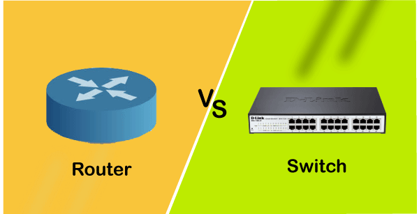{width="115%"}

:::
::::::::::::::

## Что такое маршрутизатор?

:::::::::::::: {.columns align=top}
::: {.column width="50%"}

{width="100%"}

:::
::: {.column width="50%"}

**Маршрутизатор (router)** – это активное сетевое устройство, работающее на сетевом уровне модели OSI, которое предназначено для соединения различных IP-сетей и обеспечения передачи данных между ними. Основная цель маршрутизатора - обеспечить связь между сетями, анализируя IP-адреса получателей и выбирая оптимальный маршрут для доставки пакетов.

:::
::::::::::::::

## История и развитие маршрутизатора

:::::::::::::: {.columns align=top}
::: {.column width="50%"}

История маршрутизаторов начинается в 1969 году с запуска сети ARPANET - прообраза современного Интернета. Для соединения узлов этой сети использовались устройства IMP (Interface Message Processors), которые выполняли функции, схожие с современными маршрутизаторами: они принимали данные и определяли, в какой узел их направить. Первое сообщение между двумя компьютерами было передано **29 октября 1969 года.**

:::
::: {.column width="50%"}

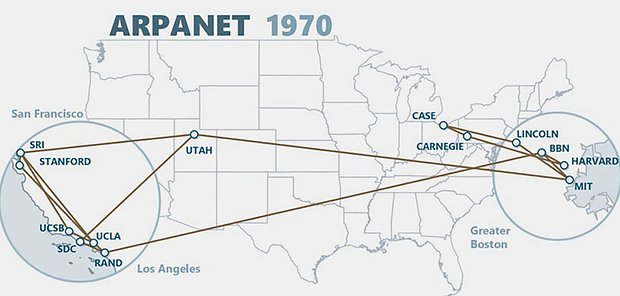{width="100%"}

:::
::::::::::::::

## История и развитие NFS

:::::::::::::: {.columns align=top}
::: {.column width="50%"}

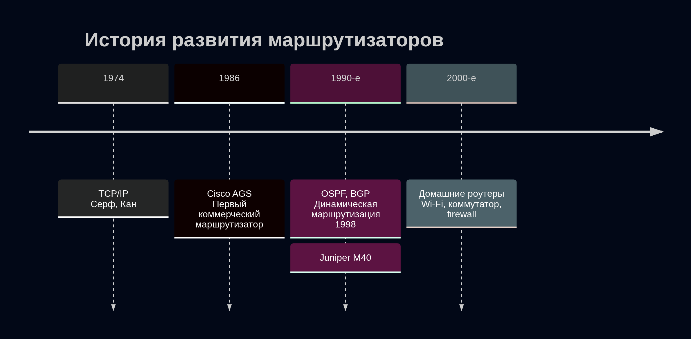{width="115%"}

:::
::: {.column width="50%"}

- **1974 г.** - TCP/IP (Серф, Кан); с **1983 г.** - основа ARPANET и интернета
- **1986 г.** - первый коммерческий маршрутизатор Cisco AGS — стандарт для корпоративных сетей
- **1990-е** - динамическая маршрутизация OSPF и BGP; 1998 г. - Juniper M40, конкурент Cisco
- **2000-е** - маршрутизаторы стали домашними универсальными устройствами (Wi-Fi, коммутатор, firewall)

:::
::::::::::::::

# Архитектура и работа маршрутизатора

## Основные компоненты архитектуры

:::::::::::::: {.columns align=top}
::: {.column width="60%"}

Компоненты маршрутизатора:

- **CPU:** выполняет команды ОС, обрабатывает протоколы маршрутизации, управляет интерфейсами
- **ROM (Read Only Memory):** хранит загрузочную программу
- **RAM (Random Access Memory):** временное хранилище
- **Flash Memory:** в ней содержится операционная система
- **NVRAM (Nonvolatile RAM):** резервная копия текущего файла конфигурации
- **Interfaces/ports:** физические разъемы: LAN и WAN

:::
::: {.column width="40%"}

{width="115%"}

:::
::::::::::::::

## Принцип работы

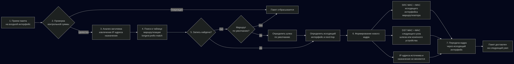{width="105%"}

:::::::::::::: {.columns align=top}
::: {.column width="50%"}

Процесс маршрутизации:

1. Прием пакета
2. Проверка целостности
3. Анализ заголовка
4. Поиск в таблице маршрутизации

:::
::: {.column width="50%"}

5. Решение - если запись найдена
6. Формирование кадра
7. Передача

:::
::::::::::::::

## Таблица маршрутизации

:::::::::::::: {.columns align=top}
::: {.column width="50%"}

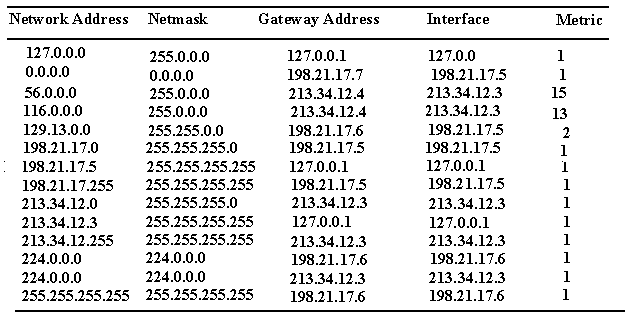{width="105%"}

:::
::: {.column width="50%"}

Каждая запись (маршрут) в таблице содержит следующие ключевые поля:

- Сеть назначения (network destination)
- Маска подсети (netmask)
- Шлюз (gateway)
- Интерфейс (interface)
- Метрика (metric)
- Тип маршрута (табл. \ref{table:route_types})
- Административная дистанция

:::
::::::::::::::

## Таблица маршрутизации

\begin{table}[H]
\centering
\footnotesize
\caption{Типы маршрутов}
\label{table:route_types}
\begin{tabular}{|p{3cm}|p{3cm}|p{7cm}|}
\hline
\textbf{Тип} & \textbf{Обозначение} & \textbf{Описание} \\ \hline
Connected & C & Прямое подключение к интерфейсу. Добавляется автоматически \\ \hline
Static & S & Вручную прописывается администратором \\ \hline
Dynamic & O, R, B и др. & Получены от протоколов динамической маршрутизации (OSPF, RIP, BGP) \\ \hline
Default & S* или O* & Маршрут по умолчанию (0.0.0.0/0). Используется, если нет конкретной записи \\ \hline
\end{tabular}
\end{table}

## Таблица маршрутизации

{width="105%"}

При поиске маршрута для пакета маршрутизатор руководствуется следующими правилами, которые применяются в указанном порядке:

1. Наиболее длинное совпадение
2. Наименьшая административная дистанция
3. Наименьшая метрика

# Ключевые функции маршрутизатора

## Ключевые функции маршрутизатора

:::::::::::::: {.columns align=top}
::: {.column width="60%"}

Маршрутизатор выполняет ряд важнейших функций:

1. **Маршрутизация (L3):** выбор пути между сетями
2. **NAT:** один публичный IP для всей локальной сети
3. **Firewall/ACL:** фильтрация трафика и защита
4. **QoS:** приоритет для важного трафика
5. **VPN:** защищенные туннели
6. **Bandwidth Management:** ограничение скорости для отдельных устройств и приложений
7. **DHCP-сервер:** автоматическая выдача IP

:::
::: {.column width="40%"}

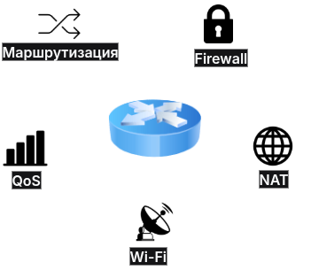{width="105%"}

:::
::::::::::::::

# Практическое применение

## Практическое применение. Построение сети

В среде Cisco Packet Tracer была построена сеть, состоящая из следующих устройств (табл. \ref{table:scheme}):

\begin{table}[H]
\centering
\caption{Устройства в построенной сети}
\label{table:scheme}
\begin{tabular}{|p{3cm}|p{3cm}|p{5cm}|}
\hline
\textbf{Устройство} & \textbf{Тип} & \textbf{Обозначение} \\ \hline
Маршрутизатор & Router 2911 & eavernikovskaya-gw \\ \hline
Коммутатор 1 & Switch 2960 & eavernikovskaya-sw-1 \\ \hline
Коммутатор 2 & Switch 2960 & eavernikovskaya-sw-2 \\ \hline
ПК0 & PC-PT & PC0-eavernikovskaya \\ \hline
ПК1 & PC-PT & PC1-eavernikovskaya \\ \hline
ПК2 & PC-PT & PC2-eavernikovskaya \\ \hline
\end{tabular}
\end{table}

## Практическое применение. Построение сети

:::::::::::::: {.columns align=top}
::: {.column width="40%"}

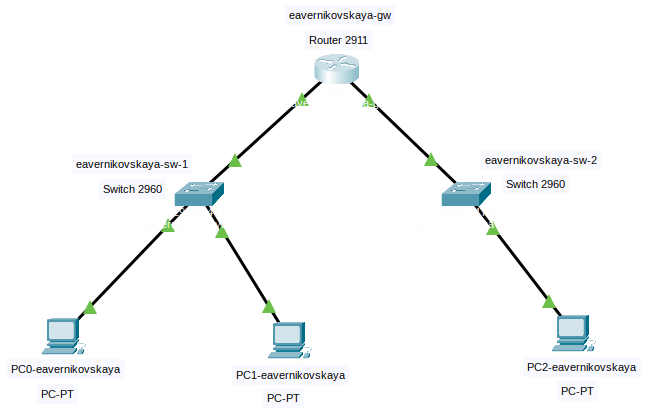{width="120%"}

:::
::: {.column width="60%"}

Схема подключения:

- PC0 и PC1 подключены к коммутатору eavernikovskaya-sw-1
- Коммутатор eavernikovskaya-sw-1 подключен к маршрутизатору eavernikovskaya-gw (интерфейс GigabitEthernet0/0)
- PC2 подключен к коммутатору eavernikovskaya-sw-2
- Коммутатор eavernikovskaya-sw-2 подключен к маршрутизатору eavernikovskaya-gw (интерфейс GigabitEthernet0/1)

:::
::::::::::::::

## Практическое применение. Настройка IP-адресации

:::::::::::::: {.columns align=top}
::: {.column width="50%"}

1. Настройка PC0-eavernikovskaya (сеть 192.168.1.0/24):

	- IP Address: 192.168.1.10
	- Subnet Mask: 255.255.255.0
	- Default Gateway: 192.168.1.1
	
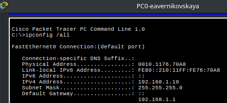{width="95%"}

:::
::: {.column width="50%"}

2. Настройка PC1-eavernikovskaya (сеть 192.168.1.0/24):

	- IP Address: 192.168.1.11
	- Subnet Mask: 255.255.255.0
	- Default Gateway: 192.168.1.1
	
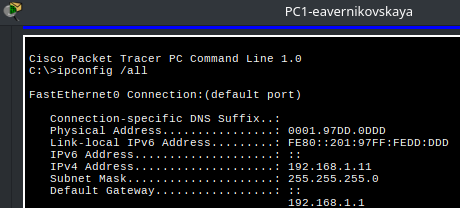{width="95%"}

:::
::::::::::::::

## Практическое применение. Настройка IP-адресации

:::::::::::::: {.columns align=top}
::: {.column width="50%"}

3. Настройка PC2-eavernikovskaya (сеть 192.168.2.0/24):

	- IP Address: 192.168.2.10
	- Subnet Mask: 255.255.255.0
	- Default Gateway: 192.168.2.1

:::
::: {.column width="50%"}
	
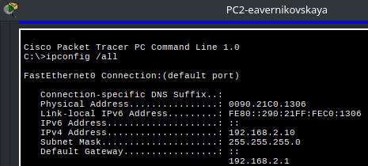{width="100%"}

:::
::::::::::::::

## Практическое применение. Настройка маршрутизатора

:::::::::::::: {.columns align=top}
::: {.column width="60%"}

{width="100%"}

:::
::: {.column width="40%"}
	
В CLI на маршрутизаторе eavernikovskaya-gw перешли в режим кофигурации. Настроили первый интерфейс (подключен к коммутатору eavernikovskaya-sw-1) и второй интерфейс (подключен к коммутатору eavernikovskaya-sw-2)

:::
::::::::::::::

## Практическое применение. Проверка связи и работы маршрутизатора

Проверили работу коммутатора внутри подсети и маршрутизатора между подсетями

:::::::::::::: {.columns align=top}
::: {.column width="50%"}

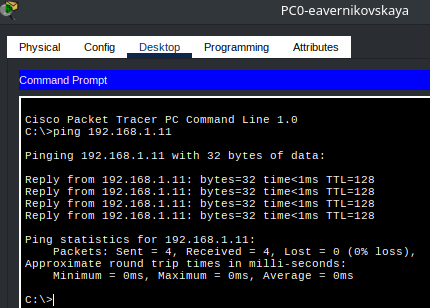{width="80%"}

:::
::: {.column width="50%"}
	
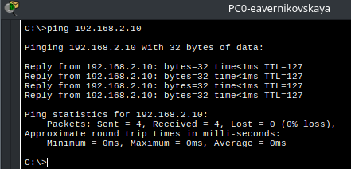{width="100%"}

:::
::::::::::::::

## Практическое применение. Анализ тблицы маршрутизации

После настройки интерфейсов маршрутизатора была выполнена проверка таблицы маршрутизации с помощью команды ```show ip route```

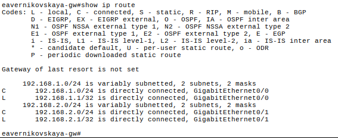{width="90%"}

## Практическое применение. Анализ прохождения пакета в Simulation Mode

Для наглядной демонстрации работы маршрутизатора был запущен режим симуляции. От PC0-eavernikovskaya к PC2-eavernikovskaya отправлен ICMP-пакет (ping-запрос)

{width="80%"}

## Практическое применение. Анализ прохождения пакета в Simulation Mode

:::::::::::::: {.columns align=top}
::: {.column width="50%"}

Inbound PDU (пакет, пришедший на маршрутизатор):

- SRC MAC: 0010.1176.70A8 (MAC-адрес PC0-eavernikovskaya)
- DST MAC: 0060.476E.1A01 (MAC-адрес маршрутизатора на интерфейсе Gi0/0)
- SRC IP: 192.168.1.10
- DST IP: 192.168.2.10

:::
::: {.column width="50%"}
	
{width="110%"}

:::
::::::::::::::

## Практическое применение. Анализ прохождения пакета в Simulation Mode

:::::::::::::: {.columns align=top}
::: {.column width="50%"}

Outbound PDU (пакет, отправленный маршрутизатором):

- SRC MAC: 0060.476E.1A02 (MAC-адрес маршрутизатора на интерфейсе Gi0/1)
- DST MAC: 0090.21C0.1306 (MAC-адрес PC2-eavernikovskaya)
- SRC IP: 192.168.1.10 (не изменился)
- DST IP: 192.168.2.10 (не изменился)

:::
::: {.column width="50%"}
	
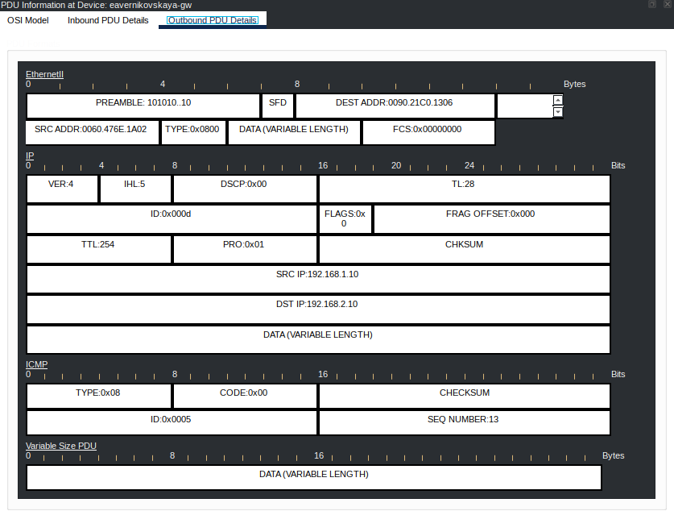{width="110%"}

:::
::::::::::::::

# Сравнительный анализ Маршрутизатор vs Коммутатор

## Сравнительная таблица

\begin{table}[H]
\centering
\footnotesize
\caption{Сравнение маршрутизатора и коммутатора}
\label{table:route_vs_switch}
\begin{tabular}{|p{4cm}|p{4cm}|p{5cm}|}
\hline
\textbf{Критерий сравнения} & \textbf{Маршрутизатор} & \textbf{Коммутатор} \\ \hline
Уровень модели OSI & Сетевой (L3) & Канальный (L2) \\ \hline
Единица передачи данных & Пакет (Packet) & Кадр (Frame) \\ \hline
Адресация & IP-адреса & MAC-адреса \\ \hline
Таблица для принятия решений & Таблица маршрутизации & CAM-таблица (MAC-адреса) \\ \hline
Назначение & Соединение разных сетей (LAN, WAN) & Объединение устройств внутри одной сети \\ \hline
Обработка трафика & Изменяет MAC-адреса & Не изменяет содержимое кадра \\ \hline
Наличие WAN-портов & Есть & Нет \\ \hline
Функции безопасности & Firewall, ACL, NAT, VPN & Минимальные \\ \hline
Типичное применение & Доступ в Интернет, VPN & Создание локальной сети (офис, квартира) \\ \hline
\end{tabular}
\end{table}

# Вывод

## Вывод

Таким образом, маршрутизатор является ключевым элементом сетевой инфраструктуры, обеспечивающим связь между различными IP-сетями. В отличие от коммутатора, который работает на канальном уровне и объединяет устройства внутри одной локальной сети, маршрутизатор функционирует на сетевом уровне, анализирует IP-адреса и выбирает оптимальный путь для передачи пакетов на основе таблицы маршрутизации. Несмотря на то, что в современных домашних и офисных сетях маршрутизатор и коммутатор часто объединены в одном корпусе, понимание их функциональных различий остается критически важным для грамотного проектирования, настройки и обслуживания сетевой инфраструктуры.

## Список литературы

1. [Difference Between Router and Switch. - geeksforgeeks, 2025](https://www.geeksforgeeks.org/computer-networks/difference-between-router-and-switch/)
2. [Internal Components of Router. - geeksforgeeks, 2025](https://www.geeksforgeeks.org/computer-networks/internal-components-of-router/)
3. [What Is a Routing Table? - jumpcloud, 2025](https://jumpcloud.com/it-index/what-is-a-routing-table)
4. [История разработки и развития маршрутизаторов и коммутаторов. - СГЭП, 2025](https://sgep-it.ru/blog/stati/istoriya-razrabotki-i-razvitiya-marshrutizatorov-i-kommutatorov/)
5. [Что такое маршрутизатор и зачем он нужен. - ITELON, 2025](https://itelon.ru/blog/chto-takoe-marhsrutizator/)
6. [Что такое маршрутизатор и как он работает - подробный гид по теме. - ServerFlow, 2025](https://serverflow.ru/blog/stati/chto-takoe-marshrutizator-i-kak-on-rabotaet-podrobnyy-gid-po-teme/)

