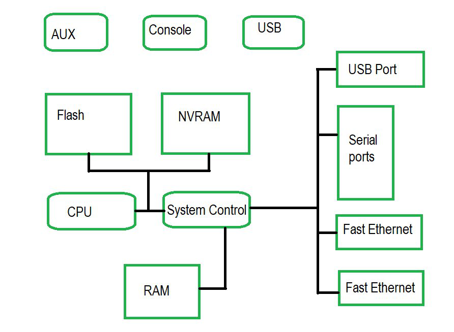
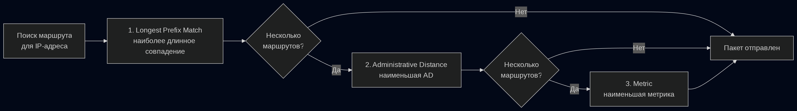
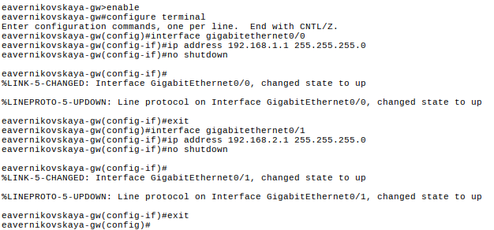
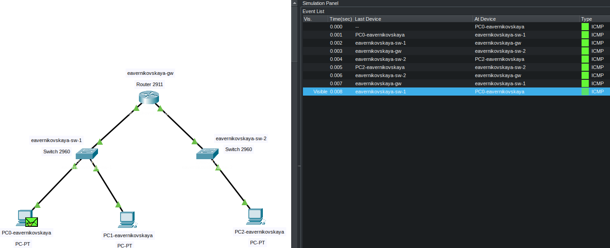
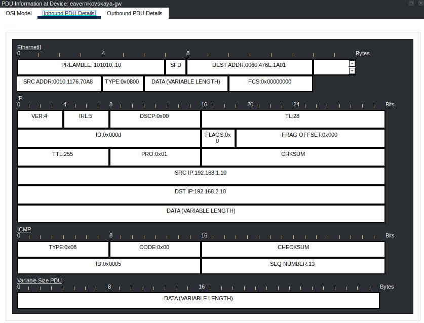

---
# Preamble

## Author
author:
  name: Верниковская Екатерина Андреевна
  degrees: Student
  orcid:
  email: 1132236136@pfur.ru
  affiliation:
    - name: Российский университет дружбы народов
      country: Российская Федерация
      postal-code: 117198
      city: Москва
      address: ул. Миклухо-Маклая, д. 6
## Title
title: "Доклад"
subtitle: "Понятие и функции маршрутизатора, отличие маршрутизаторов от коммутаторов"
license: "CC BY"
## Generic options
lang: ru-RU
number-sections: true
toc: true
toc-title: "Содержание"
toc-depth: 2
## Crossref customization
crossref:
  lof-title: "Список иллюстраций"
  lot-title: "Список таблиц"
  lol-title: "Листинги"
## Bibliography
bibliography:
  - bib/cite.bib
csl: _resources/csl/gost-r-7-0-5-2008-numeric.csl
## Formats
format:
### Pdf output format
  pdf:
    toc: true
    number-sections: true
    colorlinks: false
    toc-depth: 2
    lof: true # List of figures
    lot: true # List of tables
#### Document
    documentclass: scrreprt
    papersize: a4
    fontsize: 12pt
    linestretch: 1.5
#### Language
    babel-lang: russian
    babel-otherlangs: english
#### Biblatex
    cite-method: biblatex
    biblio-style: gost-numeric
    biblatexoptions:
      - backend=biber
      - langhook=extras
      - autolang=other*
#### Misc options
    csquotes: true
    indent: true
    header-includes: |
      \usepackage{indentfirst}
      \usepackage{float}
      \floatplacement{figure}{H}
      \usepackage[math,RM={Scale=0.94},SS={Scale=0.94},SScon={Scale=0.94},TT={Scale=MatchLowercase,FakeStretch=0.9},DefaultFeatures={Ligatures=Common}]{plex-otf}
### Docx output format
  docx:
    toc: true
    number-sections: true
    toc-depth: 2
---

# Вводная часть

**Актуальность темы и проблема:** современные сети строятся на основе маршрутизаторов и коммутаторов, но на практике эти понятия часто путают, хотя устройства выполняют принципиально разные задачи. Непонимание их функций приводит к ошибкам при построении инфраструктуры и снижению производительности сети. Актуальность темы обусловлена необходимостью четко разграничивать назначение и функции этих устройств для грамотного проектирования сетей

**Объект и предмет исследования:** сетевое оборудование, а именно принцип работы и функции маршрутизатора и коммутатора 

**Цель:** цель данного доклада – раскрыть понятие маршрутизатора, изучить его основные функции и выявить ключевые отличия от коммутатора

**Задачи исследования:** сформулировать понятие маршрутизатора, рассмотреть принципы работы маршрутизатора и коммутатора, проанализировать основные функции каждого устройства, а также выявить ключевые различия между ними на основе модели OSI и практических примеров

**Материалы и методы и инструменты исследования:** интернет-ресурсы, аналитика и практические навыки работы в среде Cisco Packet Tracer

# Введение

В любой современной компьютерной сети ключевым звеном, определяющим возможность взаимодействия между устройствами, является сетевое оборудование. Именно от его правильной настройки и понимания его функций зависит стабильность, безопасность и производительность всей инфраструктуры. Однако на практике часто возникает путаница между устройствами, которые на первый взгляд выполняют схожую задачу - передачу данных, но делают это принципиально по-разному.

Маршрутизаторы и коммутаторы лежат в основе любой сети, но их роль в ней кардинально отличается. Ошибки в выборе или настройке этих устройств ведут к снижению производительности, нестабильности соединения или невозможности взаимодействия между сегментами сети. Поэтому четкое понимание того, какое устройство за что отвечает, является базовым, но критически важным для любого, кто занимается построением и обслуживанием сетей. [@itelon]

## Что такое маршрутизатор?

**Маршрутизатор (router)** – это активное сетевое устройство, работающее на сетевом уровне модели OSI, которое предназначено для соединения различных IP-сетей и обеспечения передачи данных между ними. 

Основная цель маршрутизатора – обеспечить связь между сетями, анализируя IP-адреса получателей и выбирая оптимальный маршрут для доставки пакетов. [@serverflow]

## История и развитие маршрутизатора

История маршрутизаторов начинается в 1969 году с запуска сети ARPANET - прообраза современного Интернета. Для соединения узлов этой сети использовались устройства IMP (Interface Message Processors), которые выполняли функции, схожие с современными маршрутизаторами: они принимали данные и определяли, в какой узел их направить. Первое сообщение между двумя компьютерами было передано **29 октября 1969 года.** [@sgep]

1. **В 1974 году** Винтон Серф и Боб Кан разработали протокол TCP/IP, ставший фундаментом для маршрутизации данных. Этот протокол позволял компьютерам передавать пакеты через сети с разными архитектурами. В 1983 году TCP/IP стал основным протоколом ARPANET, заменив все другие, и используется до сих пор.

2. **В 1986 году** компания Cisco выпустила первый коммерческий маршрутизатор Cisco AGS (Advanced Gateway Server), поддерживающий несколько сетевых протоколов. Это устройство быстро стало стандартом для маршрутизации в крупных корпоративных сетях и помогло Cisco занять лидирующую позицию на рынке сетевого оборудования.

3. **В 1990-е годы** с развитием интернета были внедрены протоколы динамической маршрутизации OSPF (Open Shortest Path First) и BGP (Border Gateway Protocol), обеспечившие более эффективное управление сетевыми маршрутами. В 1998 году компания Juniper выпустила модель M40 с пропускной способностью 40 Гбит/с, составив конкуренцию Cisco. Серия Cisco 2500 стала основой для сетей малого и среднего бизнеса.

4. **В 2000-е годы** с массовым распространением широкополосного Интернета маршрутизаторы вошли в каждый дом, совмещая функции маршрутизатора, коммутатора, точки доступа Wi-Fi и межсетевого экрана.

# Архитектура и работа маршрутизатора

Для понимания принципов работы маршрутизатора необходимо рассмотреть его внутреннее устройство. Как и любой компьютер, маршрутизатор состоит из процессора, различных типов памяти и интерфейсов для подключения к сетям.

## Основные компоненты архитектуры

Маршрутизатор состоит из следующих ключевых аппаратных компонентов:

- **CPU:** Центральный процессор, выполняющий команды операционной системы, обрабатывающий протоколы маршрутизации и управляющий интерфейсами
- **ROM (Read Only Memory):** Постоянная память (READ) в маршрутизаторе в основном работает при загрузке или включении маршрутизатора. В ней хранится загрузочная программа, необходимая при включении маршрутизатора
- **RAM (Random Access Memory):** Оперативная память, выполняет роль временного хранилища для данных, необходимых для его текущей работы. Поскольку RAM является энергозависимой, при выключении или перезагрузке устройства вся информация из неё стирается. Хранит текущую конфигурацию (running-config), таблицу маршрутизации, ARP-таблицу и буферы пакетов
- **Flash Memory:** В ней содержится операционная система. Данные во флэш-памяти остаются неизменными при перезагрузке или выключении маршрутизатора. Таким образом, при каждом включении маршрутизатора ОС загружается в оперативную память из флэш-памяти
- **NVRAM (Nonvolatile RAM):**  энергонезависимая оперативная память. Это резервная копия текущего файла конфигурации. Её работа в основном помогает, когда маршрутизатор теряет питание, и ему необходимо установить конфигурацию и загрузить её заново. Содержимое NVRAM можно изменять. Когда маршрутизатор включен, он ищет файл startup-config только в NVRAM
- **Interfaces/ports:** Физические разъемы для подключения кабелей. Делятся на LAN-порты (FastEthernet, GigabitEthernet) для подключения локальной сети и WAN-порты (Serial) для связи с провайдером или удаленными сетями [@geeksforgeeks1]



## Принцип работы

Принцип работы маршрутизатора основан на анализе IP-адресов и принятии решений о пересылке пакетов на основе таблицы маршрутизации. Процесс обработки одного пакета можно представить в виде следующих шагов:

1. Прием пакета - пакет поступает на один из входных интерфейсов маршрутизатора

2. Проверка целостности - маршрутизатор проверяет контрольную сумму заголовка IP-пакета. Если пакет поврежден, он отбрасывается

3. Анализ заголовка - извлекается IP-адрес назначения. Также могут проверяться адрес источника, протокол верхнего уровня и другая информация для фильтрации или приоритезации

4. Поиск в таблице маршрутизации - маршрутизатор ищет в таблице маршрутизации запись, соответствующую IP-адресу назначения. Поиск осуществляется по принципу "наиболее длинного совпадения" (longest prefix match), то есть выбирается запись с самой конкретной маской подсети

5. Принятие решения:

	- Если запись найдена - определяется исходящий интерфейс и IP-адрес следующего маршрутизатора (next-hop)
	- Если запись не найдена - пакет отбрасывается (если нет маршрута по умолчанию)
	
6. Формирование нового кадра - маршрутизатор создает новый кадр для следующего сегмента сети:

	- MAC-адрес источника заменяется на MAC-адрес исходящего интерфейса
	- MAC-адрес назначения заменяется на MAC-адрес следующего узла (шлюза или конечного устройства)
	- IP-адреса источника и назначения остаются неизменными на всем пути следования пакета
	
7. Передача - сформированный кадр отправляется через соответствующий исходящий интерфейс


## Таблица маршрутизации

Таблица маршрутизации - это база данных, хранящаяся в оперативной памяти (RAM) маршрутизатора, которая содержит информацию о доступных сетях и способах их достижения. Именно на основе этой таблицы маршрутизатор принимает решение о пересылке каждого пакета. [@jumpcloud]

Каждая запись (маршрут) в таблице содержит следующие ключевые поля:

- **Сеть назначения (network destination):** данное поле содержит сведения об адресе хоста-получателя пакета или сети, в которой этот хост располагается. Принимая решение о маршрутизации пакета, система просматривает именно это поле. Если в данном поле не будет найдено записи о конкретном адресе сети или хоста, маршрутизатором будет использован маршрут по умолчанию
- **Маска подсети (netmask):** это поле в сочетании с предыдущим полем используется для вычисления идентификатора ip-сети
- **Шлюз (gateway):** в этом поле указывается адрес, по которому будет должен быть передан согласно данному маршруту. В большинстве случаев в этом поле указывается следующий в цепочке маршрутизатор, который должен будет принять решение о дальнейшей маршрутизации сообщения
- **Интерфейс (interface):** в этом поле указывается сетевой интерфейс, с которого будет осуществляться передача сообщения согласно данному маршруту. Данное поле необходимо в ситуации, когда маршрутизатор имеет множество сетевых интерфейсов, подключенных к разным подсетям. фактически данное поле указывает, в какую именно подсеть необходимо передать сообщение
- **Метрика (metric):** стоимость маршрута, характеризующая меру его предпочтения. Из множества альтернативных маршрутов будет выбран тот, что обладает наименьшей стоимостью (т. е. меньшим значением метрики). Некоторые алгоритмы маршрутизации сохраняют только один маршрут для любого идентификатора сети в таблице маршрутизации, даже когда существует несколько маршрутов. В этом случае метрика используется маршрутизатором, чтобы определить какой именно маршрут необходимо сохранить в таблице маршрутизации
- **Тип маршрута (табл. \ref{table:route_types}):** способ добавления маршрута в таблицу
- **Административная дистанция:** значение, определяющее надежность источника маршрута (чем меньше, тем выше приоритет)

\begin{table}[H]
\centering
\caption{Типы маршрутов}
\label{table:route_types}
\begin{tabular}{|p{4cm}|p{4cm}|p{7cm}|}
\hline
\textbf{Тип} & \textbf{Обозначение} & \textbf{Описание} \\ \hline
Connected & C & Маршруты к сетям, подключенным напрямую к интерфейсам маршрутизатора. Добавляются автоматически при настройке IP-адреса на интерфейсе \\ \hline
Static & S & Статические маршруты, которые администратор прописывает вручную. Используются в небольших сетях с простой топологией \\ \hline
Dynamic & O, R, B и др. & Маршруты, полученные от протоколов динамической маршрутизации (OSPF, RIP, BGP). Автоматически обновляются при изменении топологии сети \\ \hline
Default & S* или O* & Маршрут по умолчанию (0.0.0.0/0), используемый, когда в таблице нет записи для конкретной сети назначения. Обычно указывает на маршрутизатор провайдера \\ \hline
\end{tabular}
\end{table}

При поиске маршрута для пакета маршрутизатор руководствуется следующими правилами, которые применяются в указанном порядке:

1. Наиболее длинное совпадение - из всех подходящих маршрутов выбирается тот, у которого маска подсети самая длинная, то есть наиболее конкретно описывающая адрес назначения

2. Наименьшая административная дистанция - если до одной сети существует несколько маршрутов, полученных из разных источников (статический, динамический и т.д.), выбирается маршрут с наименьшим значением административной дистанции, что указывает на более надежный источник

3. Наименьшая метрика - если несколько маршрутов до одной сети получены от одного протокола маршрутизации, выбирается маршрут с наименьшей метрикой, которая отражает стоимость или предпочтительность пути



# Ключевые функции маршрутизатора

Маршрутизатор выполняет ряд важнейших функций, обеспечивающих связь между сетями, безопасность и эффективность передачи данных:

1. **Маршрутизация (L3):** это основная функция маршрутизатора - определение оптимального пути для передачи пакетов между различными сетями. Маршрутизатор анализирует IP-адрес назначения, обращается к таблице маршрутизации и выбирает наилучший маршрут на основе административной дистанции и метрики. Без этой функции устройства из разных подсетей не смогли бы обмениваться данными

2. **Трансляция сетевых адресов (NAT):** NAT (Network Address Translation) позволяет нескольким устройствам в локальной сети выходить в Интернет, используя один публичный IP-адрес. Это решает проблему нехватки IPv4-адресов и скрывает внутреннюю структуру сети от внешних узлов, повышая безопасность. В домашних роутерах эта функция реализована как маскарадинг (masquerading)

3. **Фильтрация трафика и обеспечение безопасности:** маршрутизатор может выступать в роли межсетевого экрана (firewall), анализируя проходящий трафик и блокируя нежелательные соединения. С помощью списков доступа (ACL) можно разрешать или запрещать передачу данных на основе IP-адресов, портов и протоколов. Это защищает сеть от несанкционированного доступа и атак извне

4. **Обеспечение качества обслуживания (QoS):** QoS (Quality of Service) позволяет приоритезировать определенные типы трафика. Например, видеозвонки и голосовой трафик (VoIP) требуют минимальных задержек, поэтому им можно назначить более высокий приоритет, чем загрузке файлов или просмотру веб-страниц. Это обеспечивает стабильную работу критически важных приложений даже при высокой загрузке канала

5. **Поддержка виртуальных частных сетей (VPN)** маршрутизатор может создавать защищенные туннели между удаленными сетями или отдельными устройствами через публичные сети (например, Интернет). VPN-функция обеспечивает шифрование передаваемых данных, аутентификацию пользователей и безопасное подключение удаленных офисов или сотрудников к корпоративной сети

6. **Управление пропускной способностью (Bandwidth Management):** маршрутизатор может ограничивать максимальную скорость для отдельных устройств, приложений или типов трафика. Это позволяет равномерно распределять ресурсы канала, предотвращая ситуацию, когда один пользователь или приложение "забирает" всю доступную пропускную способность

7. **DHCP-сервер:** маршрутизатор часто выполняет функцию DHCP-сервера, автоматически назначая IP-адреса и другие сетевые параметры (маску подсети, шлюз, DNS-серверы) устройствам в локальной сети. Это избавляет администратора от необходимости настраивать каждое устройство вручную

# Практическое применение

Для наглядной демонстрации работы маршрутизатора и его отличия от коммутатора в среде Cisco Packet Tracer была построена тестовая сеть, состоящая из двух локальных подсетей, соединенных через маршрутизатор.

## Построение сети

В среде Cisco Packet Tracer была построена сеть, состоящая из следующих устройств (табл. \ref{table:scheme}):

\begin{table}[H]
\centering
\caption{Устройства в построенной сети}
\label{table:scheme}
\begin{tabular}{|p{4cm}|p{4cm}|p{7cm}|}
\hline
\textbf{Устройство} & \textbf{Тип} & \textbf{Обозначение} \\ \hline
Маршрутизатор & Router 2911 & eavernikovskaya-gw \\ \hline
Коммутатор 1 & Switch 2960 & eavernikovskaya-sw-1 \\ \hline
Коммутатор 2 & Switch 2960 & eavernikovskaya-sw-2 \\ \hline
ПК0 & PC-PT & PC0-eavernikovskaya \\ \hline
ПК1 & PC-PT & PC1-eavernikovskaya \\ \hline
ПК2 & PC-PT & PC2-eavernikovskaya \\ \hline
\end{tabular}
\end{table}

Схема подключения:

- PC0 и PC1 подключены к коммутатору eavernikovskaya-sw-1
- Коммутатор eavernikovskaya-sw-1 подключен к маршрутизатору eavernikovskaya-gw (интерфейс GigabitEthernet0/0)
- PC2 подключен к коммутатору eavernikovskaya-sw-2
- Коммутатор eavernikovskaya-sw-2 подключен к маршрутизатору eavernikovskaya-gw (интерфейс GigabitEthernet0/1)


## Настройка IP-адресации

Назначили IP-адреса всем оконечным устройствам, формируя 2 разные подсети:

1. Настройка PC0-eavernikovskaya (сеть 192.168.1.0/24):

	- IP Address: 192.168.1.10
	- Subnet Mask: 255.255.255.0
	- Default Gateway: 192.168.1.1
	


2. Настройка PC1-eavernikovskaya (сеть 192.168.1.0/24):

	- IP Address: 192.168.1.11
	- Subnet Mask: 255.255.255.0
	- Default Gateway: 192.168.1.1
	

	
3. Настройка PC2-eavernikovskaya (сеть 192.168.2.0/24):

	- IP Address: 192.168.2.10
	- Subnet Mask: 255.255.255.0
	- Default Gateway: 192.168.2.1


## Настройка маршрутизатора

В CLI на маршрутизаторе eavernikovskaya-gw перешли в режим кофигурации:

```
enable
configure terminal
```

Настроили первый интерфейс (подключен к коммутатору eavernikovskaya-sw-1):

```
interface gigabitethernet0/0
ip address 192.168.1.1 255.255.255.0
no shutdown
exit
```

Настроили второй интерфейс (подключен к коммутатору eavernikovskaya-sw-2):

```
interface gigabitethernet0/1
ip address 192.168.2.1 255.255.255.0
no shutdown
exit
```



## Проверка связи и работы маршрутизатора

Проверили работу коммутатора внутри подсети и маршрутизатора между подсетями.

1. Проверка связи внутри одной сети (работа коммутатора):

	- С PC0-eavernikovskaya пропинговали PC1-eavernikovskaya: ```ping 192.168.1.11```
	- Пинг успешный. Пакеты передаются через коммутатор eavernikovskaya-sw-1, маршрутизатор не участвует
	


2. Проверка связи между разными сетями (работа маршрутизатора):

	- С PC0-eavernikovskaya пропинговали PC2-eavernikovskaya: ```ping 192.168.2.10```
	- Пинг успешный. Пакеты от PC0-eavernikovskaya отправляется на шлюз 192.168.1.1 (маршрутизатор), который перенаправляет его в сеть 192.168.2.0/24. Без маршрутизатора этот пинг был бы невозможен


## Анализ тблицы маршрутизации

После настройки интерфейсов маршрутизатора была выполнена проверка таблицы маршрутизации с помощью команды ```show ip route```


Таблица маршрутизации содержит записи о двух сетях, подключенных напрямую к интерфейсам маршрутизатора. Маршрутизатор автоматически добавил эти записи при назначении IP-адресов и включении интерфейсов.

## Анализ прохождения пакета в Simulation Mode

Для наглядной демонстрации работы маршрутизатора был запущен режим симуляции. От PC0-eavernikovskaya к PC2-eavernikovskaya отправлен ICMP-пакет (ping-запрос)



Посмотрели информацию о PDU маршрутизатора eavernikovskaya-gw. 

Inbound PDU (пакет, пришедший на маршрутизатор):

- SRC MAC: 0010.1176.70A8 (MAC-адрес PC0-eavernikovskaya)
- DST MAC: 0060.476E.1A01 (MAC-адрес маршрутизатора на интерфейсе Gi0/0)
- SRC IP: 192.168.1.10
- DST IP: 192.168.2.10



Outbound PDU (пакет, отправленный маршрутизатором):

- SRC MAC: 0060.476E.1A02 (MAC-адрес маршрутизатора на интерфейсе Gi0/1)
- DST MAC: 0090.21C0.1306 (MAC-адрес PC2-eavernikovskaya)
- SRC IP: 192.168.1.10 (не изменился)
- DST IP: 192.168.2.10 (не изменился)


Анализ PDU в Simulation Mode наглядно демонстрирует ключевое отличие маршрутизатора от коммутатора: при прохождении пакета через маршрутизатор MAC-адреса источника и назначения заменяются на адреса исходящего интерфейса и следующего узла, в то время как IP-адреса источника и назначения остаются неизменными на всем пути следования. Это подтверждает, что маршрутизатор работает на сетевом уровне (L3), формируя новые кадры для каждого сегмента сети, но не изменяя IP-адресацию

# Сравнительный анализ Маршрутизатор vs Коммутатор

## Сравнительная таблица

\begin{table}[H]
\centering
\caption{Сравнение маршрутизатора и коммутатора}
\label{table:route_vs_switch}
\begin{tabular}{|p{5cm}|p{5cm}|p{6cm}|}
\hline
\textbf{Критерий сравнения} & \textbf{Маршрутизатор} & \textbf{Коммутатор} \\ \hline
Уровень модели OSI & Сетевой (L3) & Канальный (L2) \\ \hline
Единица передачи данных & Пакет (Packet) & Кадр (Frame) \\ \hline
Адресация & IP-адреса & MAC-адреса \\ \hline
Таблица для принятия решений & Таблица маршрутизации & CAM-таблица (MAC-адреса) \\ \hline
Назначение & Соединение разных сетей (LAN, WAN) & Объединение устройств внутри одной сети \\ \hline
Обработка трафика & Изменяет MAC-адреса & Не изменяет содержимое кадра \\ \hline
Наличие WAN-портов & Есть (для подключения к сети провайдера) & Нет (только LAN-порты) \\ \hline
Функции безопасности & Firewall, ACL, NAT, VPN & Отсутствуют (или минимальные на управляемых коммутаторах) \\ \hline
Типичное применение & Подключение к Интернету, объединение филиалов, организация VPN & Создание локальной сети (офис, квартира) \\ \hline
\end{tabular}
\end{table}

Таким образом, коммутатор работает внутри одной сети, соединяя устройства на канальном уровне по MAC-адресам. Он обеспечивает высокую скорость передачи внутри локальной сети, но не умеет маршрутизировать трафик между разными сетями и не защищает сеть извне. Маршрутизатор работает на сетевом уровне, соединяет различные сети, выбирает оптимальные пути, обеспечивает выход в Интернет, выполняет NAT, фильтрацию трафика и поддерживает VPN. Именно он является "шлюзом" между локальной сетью и внешним миром. [@geeksforgeeks2]

В современных домашних и офисных сетях эти два устройства часто объединены в одном корпусе (например, домашний Wi-Fi роутер), но функционально их роли остаются различными.


# Выводы

Таким образом, маршрутизатор является ключевым элементом сетевой инфраструктуры, обеспечивающим связь между различными IP-сетями. В отличие от коммутатора, который работает на канальном уровне и объединяет устройства внутри одной локальной сети, маршрутизатор функционирует на сетевом уровне, анализирует IP-адреса и выбирает оптимальный путь для передачи пакетов на основе таблицы маршрутизации.

Несмотря на то, что в современных домашних и офисных сетях маршрутизатор и коммутатор часто объединены в одном корпусе, понимание их функциональных различий остается критически важным для грамотного проектирования, настройки и обслуживания сетевой инфраструктуры.

# Список литературы{.unnumbered}

::: {#refs}
::: 
